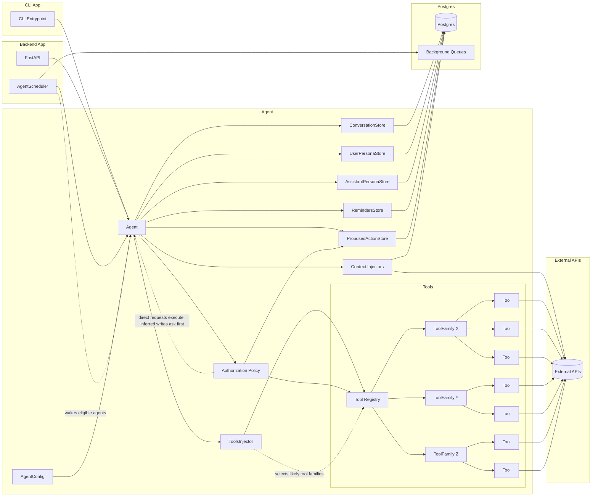

# Software Requirements Specification

## Introduction

Harle is a Telegram-first AI assistant product that should become fast, low-cost, safe, private, deeply personal, and useful for multiple subscribed users. This SRS is based on [the vision](01_VISION.md), [the feature scope](02_FEATURES.md), the current CLI/API implementation, and the product decisions confirmed so far.

This repository owns the assistant engine, Telegram runtime, memory, user data handling, and life-management tools. A separate project owns landing pages, registration, payment gateways, and web interfaces. Harle must integrate with that external product boundary without duplicating it.

## Environment

- Users interact with Harle primarily through Telegram from mobile devices.
- Users may share sensitive personal information, personal history, financial data, routines, goals, worries, and emotional context.
- The product is intended to serve multiple subscribed users, each with isolated data, configuration, tools, memories, and permissions.
- Subscription, account registration, payment flows, and web UI are handled by a separate system.
- Telegram is the only first-product chat channel. WhatsApp is a future channel because of broader market reach.
- Harle uses an AI model provider for reasoning and response generation, currently Gemini through the official Google API.
- Harle can use Google Search grounding for current information when needed.
- Harle can query real-world context such as current date, time, and weather.
- Harle can connect to external user tools, currently Google Sheets for personal finance and later reminders or calendar systems.
- Some connected tools are read-only in effect, while others modify user data or external services.
- Users expect Harle to be human-like in tone and behavior while remaining transparent that it is AI whenever identity is relevant.
- Users may rely on Harle for companionship and life improvement, but Harle must not act as a doctor, psychologist, therapist, or clinical authority.
- The current implementation supports a single configured Telegram user, local or PostgreSQL conversation persistence, CLI usage, and Google Sheets expense tools.

## User Requirements

- **UR-01 Telegram access**: A subscribed user shall be able to talk to Harle through Telegram.
- **UR-02 Multi-user isolation**: Each user shall experience Harle as a private personal assistant with isolated conversations, profile data, tools, credentials, and preferences.
- **UR-03 Natural conversation**: Harle shall respond in the user's language with a concise, natural, warm, and useful style.
- **UR-04 Personal memory**: Harle shall remember prior conversations, user-provided personal history, durable facts, preferences, routines, goals, and learned patterns.
- **UR-05 User profile**: Harle shall maintain a profile of the user that improves personalization over time.
- **UR-06 Agent profile**: Harle shall maintain its own configurable assistant profile, changeable under user direction, without claiming to be human.
- **UR-07 Memory control**: The user shall be able to inspect, correct, delete, and refine memory, user profile data, and agent profile data.
- **UR-08 Read on request**: Harle may read or query connected data when the user asks a question and the action does not modify the environment.
- **UR-09 User-authorized modification**: Harle shall never modify expenses, reminders, calendar events, memories, profiles, or external services unless the user directly requested that modification, or explicitly approved a modification Harle proposed.
- **UR-10 Personal finance**: Harle shall help users query, add, correct, and understand personal finance data through natural conversation.
- **UR-11 Productivity support**: Harle shall provide at least one first-product productivity capability, either custom reminders, calendar integration, or both.
- **UR-12 Companionship**: Harle shall help users feel better, reflect, stay organized, and improve their lives while respecting healthy relationship boundaries.
- **UR-13 Proactive support**: Harle shall be able to follow up, remind, or check in when the user has enabled that behavior, the follow-up is useful, and the action respects the user's notification preferences.
- **UR-14 Privacy and safety**: Harle shall protect user data, minimize unnecessary exposure, and make safety a core product behavior.
- **UR-15 Transparency**: Harle shall not hide that it is AI or simulate human identity in manipulative ways.
- **UR-16 Reliability**: Harle shall report failures clearly when it cannot answer or complete a requested action.
- **UR-17 Efficiency**: Harle shall pursue fast and inexpensive responses suitable for frequent daily use.

## System Specification

### Identity, Access, and Subscription

- **FR-01**: The Telegram webhook shall validate Telegram's webhook secret before processing any update.
- **FR-02**: The system shall extract Telegram chat ID, Telegram user ID, display name, and text from incoming Telegram updates.
- **FR-03**: The system shall reject empty, unsupported, malformed, unauthorized, or unsubscribed messages without invoking the assistant engine.
- **FR-04**: The single `TELEGRAM_ALLOWED_USER_ID` model shall be replaced or extended with a multi-user account registry.
- **FR-05**: The system shall map each allowed Telegram user to one internal user account.
- **FR-06**: The system shall consume subscription state from the external registration and payment product.
- **FR-07**: The system shall deny assistant access when a user's subscription is inactive, expired, missing, or revoked.
- **FR-08**: User credentials and connected tool settings shall be scoped to the internal user account, not to global process configuration.

### Conversation Runtime

- **FR-09**: The Telegram runtime shall send a typing action before generating a response when possible.
- **FR-10**: The assistant engine shall load conversation context, user profile, agent profile, personal history, current date and time, relevant environmental context, and relevant tool families before answering.
- **FR-11**: Context loading should run concurrently where safe, so slow data sources do not unnecessarily delay the response.
- **FR-12**: The assistant shall choose between answering directly, asking for authorization for an inferred modification, or calling an available authorized tool.
- **FR-13**: The assistant shall execute at most a configured number of reasoning and tool loops for one user message.
- **FR-14**: The assistant shall return a user-facing failure message when model output is invalid, unavailable, or cannot be parsed.
- **FR-15**: The Telegram runtime shall split long responses into Telegram-compatible message chunks.
- **FR-16**: The system shall persist the final user prompt and assistant response after each handled conversation.

### Memory and Profiles

- **FR-17**: The system shall persist all prior conversations in durable storage for product users.
- **FR-18**: The system shall make prior conversations available to Harle through retrieval, summarization, or another bounded-context strategy.
- **FR-19**: The system shall store user profile data separately from raw conversation history.
- **FR-20**: The system shall store agent profile data separately from user profile data.
- **FR-21**: The system shall preserve user-provided personal history as first-class memory.
- **FR-22**: The system shall provide commands or flows for users to view, correct, delete, and refine stored memory.
- **FR-23**: The system shall change user memory, user profile data, or agent profile data only after direct user request or explicit user authorization.
- **FR-24**: Memory retrieval shall respect per-user isolation and must never include another user's data.

### Authorization and Tool Safety

- **FR-25**: Every tool shall declare whether it is read-only or environment-modifying.
- **FR-26**: Read-only tools may run after a user request without an additional authorization step.
- **FR-27**: Environment-modifying tools may execute immediately when the current user message directly requested the modification and the required arguments are clear.
- **FR-28**: Environment-modifying tools shall produce a proposed action instead of executing immediately when Harle inferred, suggested, or initiated the modification itself.
- **FR-29**: A proposed action shall include the proposed change, affected service, affected data, and a clear authorization prompt.
- **FR-30**: The system shall execute a proposed action only after the same user explicitly authorizes it.
- **FR-31**: Proposed actions shall expire or be cancellable to avoid accidental later execution, and after execution Harle shall report what changed and whether the operation succeeded.
- **FR-32**: Failed tool actions shall return a clear explanation and should not silently retry in ways that risk duplicate writes.
- **FR-33**: Tool results shall be included in the assistant's reasoning context for the current response.

### Personal Finance

- **FR-34**: Harle shall query a user's finance data for a specific day.
- **FR-35**: Harle shall query a user's finance data for a specific month.
- **FR-36**: Harle shall add one-time expenses and refunds after direct user request or explicit user authorization.
- **FR-37**: Harle shall add installment purchases from 2 to 12 installments after direct user request or explicit user authorization.
- **FR-38**: Harle shall remove or update an existing transaction after direct user request or explicit user authorization.
- **FR-39**: Harle shall support the current expense categories for rent, essential services, non-essential services, home, transport, outings, shopping, and other expenses.
- **FR-40**: Harle shall apply the product-defined date handling rule for late-night or early-day transactions and tell the user when it assigns an expense to the previous day.
- **FR-41**: Finance tools shall validate amounts, dates, months, categories, refund flags, and installment counts before proposing or executing changes.
- **FR-42**: Finance tools shall not modify spreadsheet cells outside the configured expense ranges.
- **FR-43**: Finance tool credentials and spreadsheet IDs shall be user-scoped before multi-user release.

### Productivity

- **FR-44**: The first paid product shall include custom reminders, calendar integration, or both.
- **FR-45**: Harle may query reminders or calendar data when answering a user's question.
- **FR-46**: Harle shall create, update, delete, or reschedule reminders or calendar events only after direct user request or explicit user authorization.
- **FR-47**: Reminder notifications and proactive check-ins shall respect user preferences, quiet periods, and opt-in settings.
- **FR-48**: Calendar or reminder integrations shall be user-scoped and revocable.

### Companionship and Safety

- **FR-49**: Harle shall preserve a warm, useful, concise, and non-performative conversation style.
- **FR-50**: Harle shall be transparent that it is AI when identity or nature is relevant.
- **FR-51**: Harle shall not claim to be a human, doctor, psychologist, therapist, lawyer, financial advisor, or other professional authority.
- **FR-52**: Harle shall encourage appropriate human or professional help when user needs exceed the assistant's role.
- **FR-53**: Harle shall avoid manipulative behavior, dependency-building patterns, and advice that reduces user agency.
- **FR-54**: Harle shall allow proactive check-ins only when they are user-enabled, useful, and bounded by notification preferences.

### Runtime Architecture

- **FR-55**: The agent runtime shall support both request-triggered runs and scheduled background runs.
- **FR-56**: The agent scheduler shall periodically select eligible users or agents for proactive checks, respecting opt-in settings, quiet periods, rate limits, and randomization or prioritization rules.
- **FR-57**: A scheduled agent run shall load the same user-scoped context as a normal conversation, including conversations, profile data, agent profile data, reminders, relevant external context, and relevant tool families.
- **FR-58**: Scheduler work, proposed actions, outbound messages, and integration polling shall use durable background queues when the work must survive process restarts or deployment interruptions.
- **FR-59**: The runtime shall construct user-scoped stores and tool configuration from the resolved internal user account, not from global process configuration.
- **FR-60**: Stores that require external connections shall use process-wide connection pools where appropriate while preserving per-user data boundaries in store adapters.
- **FR-61**: Context providers or injectors shall expose cached or polled user-relevant data such as weather, location, reminders, calendar state, or other authorized external context.
- **FR-62**: Context injectors may be process singletons only when shared state is safe; user-specific values, credentials, and permissions shall remain isolated by account.
- **FR-63**: The tool system shall maintain a registry of tool families, tool names, descriptions, argument schemas, read-only or modifying classification, and execution policy.
- **FR-64**: The tools injector shall select the tool families most likely to help with the current prompt and runtime context instead of always injecting every full tool prompt.
- **FR-65**: The assistant may receive a compact list of all available tool names for discoverability, but detailed tool descriptions and argument contracts should be limited to the most relevant tools.
- **FR-66**: Modifying tools shall distinguish between direct user-requested actions, which may execute after validation, and inferred or proactive actions, which must become proposed actions first.
- **FR-67**: Reminder storage shall support user ownership, reminder content, schedule, recurrence if needed, delivery status, cancellation, and links to any originating conversation or proposed action.

### Nonfunctional Requirements

- **NFR-01 Privacy**: User data shall be private by default and isolated by account.
- **NFR-02 Security**: Secrets shall be loaded from secure configuration and never committed to source control.
- **NFR-03 Least privilege**: External tool credentials shall request the minimum practical permissions.
- **NFR-04 Auditability**: Environment-modifying actions shall be auditable with user, timestamp, proposed action, authorization, and final result.
- **NFR-05 Sensitive logging**: Logs shall avoid storing full personal conversations, private profile content, credentials, or unnecessary tool payloads.
- **NFR-06 Transport security**: Production traffic shall use HTTPS and secure webhook configuration.
- **NFR-07 Data durability**: Product conversation data shall use durable storage, backups, and migration-safe schemas.
- **NFR-08 Data deletion**: The system shall support user data deletion consistent with the product's privacy policy.
- **NFR-09 Latency**: The system shall minimize user-perceived latency through concurrency, caching, concise prompts, and efficient model selection.
- **NFR-10 Cost**: The system shall minimize token usage and external API cost without degrading useful answer quality.
- **NFR-11 Reliability**: The system shall handle provider failures, malformed model output, Telegram failures, and tool failures gracefully.
- **NFR-12 Maintainability**: Assistant, API, storage, and tools shall remain modular enough to add new integrations without creating a brittle tool collection.
- **NFR-13 Observability**: Production operations shall expose enough logs, metrics, and health checks to detect failures and cost regressions.
- **NFR-14 Compliance discovery**: Legal, privacy, and security obligations for storing sensitive user data shall be investigated before broad paid release.
- **NFR-15 Background reliability**: Scheduled runs, queued work, and outbound notifications shall be observable, retryable where safe, and auditable enough to diagnose missed or duplicate actions.

## Program

Harle is conceptually divided into these program areas:

- **Telegram interface**: Receives Telegram webhook updates, validates access, extracts messages, sends typing indicators, sends responses, and enforces Telegram message limits.
- **CLI interface**: Provides a local entry point for direct prompts while reusing the same assistant engine, stores, tools, and model configuration.
- **Assistant engine**: Builds the assistant context, calls the model, parses structured model output, decides whether to respond, request authorization, or call tools, caps tool loops, and returns final text.
- **Agent scheduler**: Wakes eligible user agents for reminders, follow-ups, proactive checks, and other bounded background behavior.
- **Memory and profile stores**: Persist conversations, retrieve bounded context, store durable user profile data, store agent profile data, and support user-controlled memory operations.
- **Reminder and proposed-action stores**: Persist reminders, scheduled work, proposed actions, authorization state, expiration, cancellation, and execution results.
- **Context injectors**: Provide cached or polled user-relevant context, such as weather, location, calendar state, reminder state, and other authorized external data.
- **Tool system**: Defines available tool families, classifies tools as read-only or modifying, validates arguments, selects relevant tools for each prompt, applies authorization rules, executes approved actions, and returns structured results.
- **External integrations**: Connects to AI providers, Telegram, PostgreSQL, Google Sheets, future productivity services, weather data, and external account or subscription systems.

The current code already contains the assistant engine, Telegram webhook, CLI entry point, local and PostgreSQL conversation storage, weather context, Google Search grounding, and Google Sheets finance tools. The main product gaps are multi-user account mapping, subscription entitlement checks, user-scoped credentials, user-scoped profile stores, reminder storage, proposed-action storage, the agent scheduler, context injectors, selective tool injection, durable background queues, privacy controls, and the first productivity integration.

The expected message flow is:

1. Telegram sends an update to the webhook.
2. The API validates the webhook secret and parses the text message.
3. The API resolves the Telegram user to an active subscribed Harle account.
4. The runtime builds user-scoped stores, context providers, and tool configuration.
5. Harle loads relevant memory, profile data, reminder state, current context, and selected tool families.
6. Harle calls the model and either responds, asks for authorization, or calls an authorized tool.
7. Read-only actions may execute immediately; modifying actions may execute immediately when directly requested by the user and valid, while inferred or proactive modifications become proposed actions.
8. Harle sends the final response through Telegram.
9. The system persists the conversation, tool calls, proposed actions, and executed action records.

The expected scheduled-agent flow is:

1. The scheduler wakes at a configured interval.
2. The scheduler selects eligible user agents according to opt-in state, quiet periods, rate limits, reminder due dates, and randomization or priority rules.
3. The runtime builds the same user-scoped stores, context providers, and tool configuration used for normal requests.
4. Harle loads relevant context and decides whether a follow-up, reminder, proposed action, or no-op is appropriate.
5. Harle sends an outbound message only when allowed by user preferences and platform limits.
6. Any modification not directly requested by the user becomes a proposed action requiring user authorization.
7. The system persists the scheduled run, decision, outbound message, proposed action, or no-op result.

## Machine

The current machine environment is Python 3.10 or newer with FastAPI, Uvicorn, Pydantic, asyncpg, httpx, google-genai, gspread, and Google service account authentication.

Runtime dependencies include:

- **Telegram Bot API** for webhook delivery and message sending.
- **Gemini API** for assistant reasoning and generation.
- **Google Search grounding** through the configured model provider.
- **PostgreSQL** for durable production storage.
- **Durable background queues** for scheduled runs, proposed actions, outbound messages, and polling work when reliability requires persistence across restarts.
- **SQLite** for local development or temporary fallback storage.
- **Google Sheets API** for current personal finance tools.
- **Open-Meteo** for current weather context.
- **Future productivity providers** for reminders or calendar data.
- **External product system** for registration, subscription, and payment status.

Production deployment shall provide:

- Secure environment variable management for API keys, Telegram secrets, database URLs, and service credentials.
- Durable PostgreSQL storage with schema migrations and backups.
- A webhook endpoint reachable through HTTPS.
- Health checks for platform availability.
- Connection pooling appropriate for expected user count.
- Monitoring for request failures, provider failures, latency, token usage, and tool execution failures.
- Monitoring for scheduled runs, queue backlog, duplicate prevention, missed reminders, and outbound notification failures.
- A strategy for scaling beyond a single personal bot configuration.

Open requirements that need product discovery:

- Exact privacy and legal requirements for storing conversations, profiles, personal history, and finance data.
- Subscription plan boundaries, usage limits, free trials, failed payments, and cancellation behavior.
- Telegram authorization UX for approving, cancelling, and expiring proposed modifications.
- The first productivity feature decision: custom reminders, calendar integration, or both.
- Data retention, deletion, export, and backup policies.
- Concrete latency, cost, and reliability targets for paid launch.
- WhatsApp integration requirements for a later product phase.

## Appendix A: Target Architecture Diagram

This diagram represents the intended architecture, not the current implementation state.

