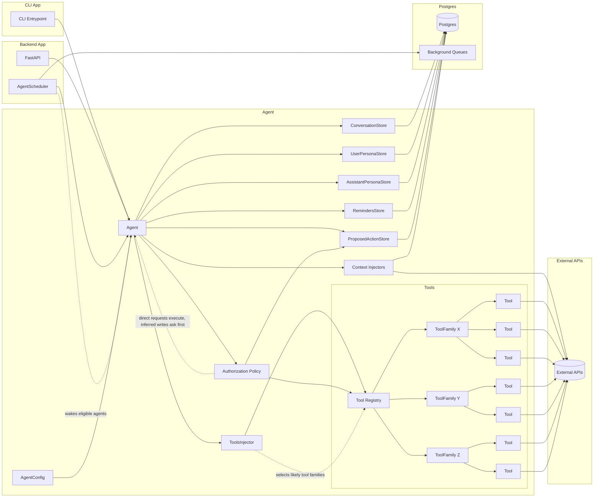

# Software Requirements Specification

## Introduction

Harle is a Telegram-first AI assistant product that should be fast, low-cost, safe, private, deeply personal, and useful for multiple subscribed users. This SRS is based on [the vision](01_VISION.md), [the feature scope](02_FEATURES.md), the current controlled-beta implementation, and the product decisions confirmed so far.

This repository owns the assistant engine, Telegram runtime, memory, user data handling, and life-management tools. A separate project owns landing pages, registration, payment gateways, and web interfaces. Harle must integrate with that external product boundary without duplicating it.

This document distinguishes the implemented controlled-beta baseline from target requirements that remain pending. Pending requirements remain part of the product unless they are explicitly placed in a later scope.

## Environment

- Users interact with Harle primarily through Telegram from mobile devices.
- Users may share sensitive personal information, personal history, financial data, routines, goals, worries, and emotional context.
- The controlled beta serves multiple subscribed users, each with isolated data, configuration, tools, memories, and permissions.
- Subscription, account registration, payment flows, and web UI are handled by a separate system.
- Telegram is the only first-product chat channel. WhatsApp is a future channel because of broader market reach.
- The commercial runtime uses one FastAPI process and PostgreSQL. The CLI remains a local development interface.
- Harle uses an AI model provider for reasoning and response generation, currently Gemini through the official Google API.
- Harle can use Google Search grounding for current information when needed.
- Harle can query real-world context such as current date, time, and weather.
- Commercial users use internal PostgreSQL expenses and events. Juan José Farina alone retains the private legacy Google Sheets expense integration.
- Some connected tools are read-only in effect, while others modify user data or external services.
- Users expect Harle to be human-like in tone and behavior while remaining transparent that it is AI whenever identity is relevant.
- Users may rely on Harle for companionship and life improvement, but Harle must not act as a doctor, psychologist, therapist, or clinical authority.

## Implemented Controlled-Beta Baseline

- Telegram identities map to manually provisioned internal users with a configured plan and subscription status.
- Harle, conversation stores, profiles, tool handlers, and user context are constructed or bound for the resolved user.
- PostgreSQL stores Telegram conversations, tool interactions, profiles, personal history, internal expenses, internal events, and Telegram update claims.
- Tool authorization gives commercial users internal expenses and events. Juan receives internal events and legacy Google Sheets expenses instead of internal expenses.
- Commercial expenses use Argentine pesos, fixed categories, permanent deletion, and transaction UUIDs. Updating or deleting one installment affects its complete installment group.
- Internal events are passive, private, one-time timed or all-day records. Cancellation retains an event; deletion is permanent.
- Telegram updates are persisted and deduplicated before assistant execution. Consecutive messages may join a turn until tool execution or delivery begins.
- The tenth valid message within two seconds triggers a per-identity cooldown. Cooldowns escalate from 60 seconds to 5 minutes and then 1 hour, and strikes decay after normal use.
- Monthly quotas count successful completed conversations within UTC month boundaries and include process-local in-flight reservations. Configured plan limits, rather than application constants, determine allowance.
- Runtime authorization for inferred writes, action audits, durable work queues, automated subscription synchronization, privacy workflows, reminders, proactive behavior, and multi-user Google integrations remain pending.

## User Requirements

- **UR-01 Telegram access**: A subscribed user shall be able to talk to Harle through Telegram.
- **UR-02 Multi-user isolation**: Each user shall experience Harle as a private personal assistant with isolated conversations, profile data, tools, credentials, and preferences.
- **UR-03 Natural conversation**: Harle shall respond in the user's language with a concise, natural, warm, and useful style.
- **UR-04 Personal memory**: Harle shall remember prior conversations, user-provided personal history, durable facts, preferences, routines, goals, and learned patterns.
- **UR-05 User profile**: Harle shall maintain a profile of the user that improves personalization over time.
- **UR-06 Agent profile**: Harle shall maintain its own configurable assistant profile, changeable under user direction, without claiming to be human.
- **UR-07 Memory control**: The user shall be able to inspect, correct, delete, and refine memory, user profile data, and agent profile data.
- **UR-08 Read on request**: Harle may read or query connected data when the user asks a question and the action does not modify the environment.
- **UR-09 User-authorized modification**: Harle shall modify data immediately only when the current user message directly requests it. The target product shall require explicit confirmation before executing an inferred or assistant-proposed modification.
- **UR-10 Personal finance**: Harle shall help users query, add, correct, and understand personal finance data through natural conversation.
- **UR-11 Productivity support**: Harle shall provide private internal events in the controlled beta and may later add reminders, notifications, or external calendar integration.
- **UR-12 Companionship**: Harle shall help users feel better, reflect, stay organized, and improve their lives while respecting healthy relationship boundaries.
- **UR-13 Proactive support**: The target product shall be able to follow up, remind, or check in when the user has enabled that behavior, the follow-up is useful, and the action respects the user's notification preferences.
- **UR-14 Privacy and safety**: Harle shall protect user data, minimize unnecessary exposure, and make safety a core product behavior.
- **UR-15 Transparency**: Harle shall not hide that it is AI or simulate human identity in manipulative ways.
- **UR-16 Reliability**: Harle shall report failures clearly when it cannot answer or complete a requested action.
- **UR-17 Efficiency**: Harle shall pursue fast and inexpensive responses suitable for frequent daily use.

## System Specification

### Identity, Access, and Subscription

- **FR-01**: The Telegram webhook shall validate Telegram's webhook secret before processing any update.
- **FR-02**: The system shall extract Telegram chat ID, Telegram user ID, display name, and text from incoming Telegram updates.
- **FR-03**: The system shall reject empty, unsupported, malformed, unauthorized, or unsubscribed messages without invoking the assistant engine.
- **FR-04**: The system shall resolve each Telegram sender through a multi-user external-identity registry.
- **FR-05**: The system shall map each allowed Telegram user to one internal user account.
- **FR-06**: The controlled beta shall support explicit user provisioning. The target broad release shall synchronize subscription state from the external registration and payment product.
- **FR-07**: The system shall deny assistant access when a user's subscription is inactive, expired, missing, or revoked.
- **FR-08**: User integrations shall be scoped to the internal account. Juan's private legacy Google Sheets credentials and spreadsheet identifiers may remain process configuration, but access shall depend only on his configured stable internal UUID.

### Conversation Runtime

- **FR-09**: The Telegram runtime shall send a typing action before generating a response when possible.
- **FR-10**: The assistant engine shall load conversation context, user profile, agent profile, personal history, current date and time, relevant environmental context, and relevant tool families before answering.
- **FR-11**: Context loading should run concurrently where safe, so slow data sources do not unnecessarily delay the response.
- **FR-12**: The assistant shall answer directly or call an available authorized tool. The target runtime may instead ask for authorization when a modification was not directly requested.
- **FR-13**: The assistant shall execute at most a configured number of reasoning and tool loops for one user message.
- **FR-14**: The assistant shall return a user-facing failure message when model output is invalid, unavailable, or cannot be parsed.
- **FR-15**: The Telegram runtime shall split long responses into Telegram-compatible message chunks.
- **FR-16**: The system shall persist the final user prompt and assistant response after each handled conversation.

### Telegram Intake, Ordering, Bans, and Quotas

- **FR-68**: The webhook shall persist and claim each Telegram `update_id` before quota checks, Gemini calls, or tool execution.
- **FR-69**: A duplicate update shall create no second Gemini call, conversation, response, or tool modification, including after a process restart.
- **FR-70**: Consecutive messages from one Telegram identity shall join the active turn while reasoning remains safe to cancel and restart. Messages arriving after tool execution or response delivery begins shall become the next turn.
- **FR-71**: Conflicting work for one Telegram identity shall be serialized without blocking other identities. Process-local coordination is permitted while deployment remains one process.
- **FR-72**: Every newly persisted valid update shall count independently toward a rolling safety window, even when messages later join one turn.
- **FR-73**: The tenth valid update within two seconds shall trigger a ban for only that Telegram identity. Cooldowns shall escalate from at least 60 seconds to 5 minutes and then 1 hour, strikes shall decay after normal use, and Harle shall send at most one notice per cooldown.
- **FR-74**: Duplicate, malformed, temporarily banned, unauthorized, inactive, and operationally rejected updates shall not invoke Gemini or consume monthly quota.
- **FR-75**: Monthly usage shall count only successful rows where `kind = 'conversation'` and `status = 'completed'`, using explicit inclusive-start and exclusive-end UTC month boundaries.
- **FR-76**: Quota admission shall include process-local in-flight reservations, release reservations on every outcome, and exclude tool calls, retries, failed conversations, and individual messages aggregated into one conversation.
- **FR-77**: An over-quota response shall expose the remaining allowance and exact reset boundary without invoking Gemini.
- **FR-78**: Plan limits shall come from account or plan configuration. The provisional free, basic, and max limits are 60, 480, and 1,920 monthly conversations.
- **FR-79**: Conversation and tool-interaction persistence shall use stable update-derived identifiers where required to prevent duplicate records.

### Memory and Profiles

- **FR-17**: The system shall persist all prior conversations in durable storage for product users.
- **FR-18**: The system shall make prior conversations available to Harle through a bounded-context strategy. Retrieval and summarization may be added later.
- **FR-19**: The system shall store user profile data separately from raw conversation history.
- **FR-20**: The system shall store agent profile data separately from user profile data.
- **FR-21**: The system shall preserve user-provided personal history as first-class memory.
- **FR-22**: The target product shall provide commands or flows for users to view, correct, delete, and refine stored memory.
- **FR-23**: The target product shall change user memory, user profile data, or agent profile data only after direct user request or explicit user authorization.
- **FR-24**: Memory retrieval shall respect per-user isolation and must never include another user's data.

### Authorization and Tool Safety

- **FR-25**: Every tool shall declare whether it is read-only or environment-modifying.
- **FR-26**: Read-only tools may run after a user request without an additional authorization step.
- **FR-27**: Environment-modifying tools may execute immediately when the current user message directly requested the modification and the required arguments are clear.
- **FR-28**: The controlled beta shall instruct Harle not to call a modifying tool unless the current message directly requests the change. A separate runtime gate remains pending.
- **FR-29**: The target runtime shall persist an inferred, suggested, or proactive modification as a proposed action instead of executing it.
- **FR-30**: A proposed action shall identify the change, service, affected data, owner, expiration, and authorization state.
- **FR-31**: The target runtime shall execute a proposed action only after the same user confirms it, and shall support cancellation, expiration, duplicate confirmation, and a clear final result.
- **FR-32**: Failed tool actions shall return a clear explanation and should not silently retry in ways that risk duplicate writes.
- **FR-33**: Tool results shall be included in the assistant's reasoning context for the current response.

### Personal Finance

- **FR-34**: Harle shall query a user's finance data for a specific day.
- **FR-35**: Harle shall summarize a user's finance data for a specific month.
- **FR-36**: Commercial finance records shall use PostgreSQL, Argentine pesos, positive stored amounts, and explicit expense or refund semantics.
- **FR-37**: Harle shall add purchases in 2 to 12 installments, allocate currency fractions deterministically, use the selected date for the first installment, and use the first day of each following month thereafter.
- **FR-38**: Commercial finance corrections shall use transaction UUIDs. Updating or permanently deleting an installment transaction shall affect its entire installment group while preserving the installment count on update.
- **FR-39**: Harle shall support the current expense categories for rent, essential services, non-essential services, home, transport, outings, shopping, and other expenses.
- **FR-40**: A transaction without an explicit date created from 00:00 through 04:59 in the user's local timezone shall use the previous calendar day, and Harle shall tell the user when this rule applies.
- **FR-41**: Finance tools shall validate amounts, dates, months, categories, refund flags, and installment counts before proposing or executing changes.
- **FR-42**: Every internal finance operation shall filter by the requesting user's UUID. Legacy Google Sheets tools shall not modify cells outside the configured expense ranges.
- **FR-43**: Commercial users shall receive internal expense tools. Only Juan's configured stable internal UUID shall receive, construct, or execute legacy Google Sheets expense tools.

### Productivity

- **FR-44**: The controlled beta shall provide private, passive, one-time internal events to every entitled user.
- **FR-45**: Harle shall list owned events overlapping a bounded local date range, excluding cancelled events unless the user requests them.
- **FR-46**: Harle shall create, update, cancel, or permanently delete only events owned by the requesting user and only when the current message directly requests the modification.
- **FR-47**: Events shall support timed and all-day schedules, preserve the originating IANA timezone, store UTC boundaries, and require the end to follow the start.
- **FR-48**: Controlled-beta events shall create no recurrence, attendees, reminders, notifications, external synchronization, or background work. Later reminder or calendar integrations shall be user-scoped, revocable, and governed by the target authorization policy.

### Companionship and Safety

- **FR-49**: Harle shall preserve a warm, useful, concise, and non-performative conversation style.
- **FR-50**: Harle shall be transparent that it is AI when identity or nature is relevant.
- **FR-51**: Harle shall not claim to be a human, doctor, psychologist, therapist, lawyer, financial advisor, or other professional authority.
- **FR-52**: Harle shall encourage appropriate human or professional help when user needs exceed the assistant's role.
- **FR-53**: Harle shall avoid manipulative behavior, dependency-building patterns, and advice that reduces user agency.
- **FR-54**: Harle shall allow proactive check-ins only when they are user-enabled, useful, and bounded by notification preferences.

### Runtime Architecture

- **FR-55**: The controlled-beta runtime shall support request-triggered Telegram runs. Scheduled background runs are a later capability.
- **FR-56**: A future agent scheduler shall select eligible users or agents for proactive checks, respecting opt-in settings, quiet periods, rate limits, and bounded prioritization rules.
- **FR-57**: A future scheduled run shall load the same user-scoped context as a normal conversation, including conversations, profiles, reminders, relevant external context, and authorized tool families.
- **FR-58**: The target broad-release runtime shall use durable background queues for accepted inbound work and outbound delivery. Future scheduler work, proposed actions, and integration polling shall also use durable queues when work must survive interruptions.
- **FR-59**: The runtime shall construct user-scoped stores and tool configuration from the resolved internal user account. Only Juan's UUID-gated legacy Google Sheets compatibility path may use integration settings from process configuration.
- **FR-60**: Stores that require external connections shall use process-wide connection pools where appropriate while preserving per-user data boundaries in store adapters.
- **FR-61**: Context providers shall expose current time and weather from user-scoped timezone and location inputs. Cached or polled reminders, calendar state, and other authorized context may be added later.
- **FR-62**: Context injectors may be process singletons only when shared state is safe; user-specific values, credentials, and permissions shall remain isolated by account.
- **FR-63**: The tool system shall maintain a registry of tool families, tool names, descriptions, argument schemas, read-only or modifying classification, and execution policy.
- **FR-64**: The tools injector shall select the tool families most likely to help with the current prompt and runtime context instead of always injecting every full tool prompt.
- **FR-65**: The assistant may receive a compact list of all available tool names for discoverability, but detailed tool descriptions and argument contracts should be limited to the most relevant tools.
- **FR-66**: Modifying tools shall distinguish direct requests from inferred or proactive actions. The controlled beta enforces this through the assistant instruction; the target runtime shall enforce it through proposed actions.
- **FR-67**: Future reminder storage shall support user ownership, content, schedule, recurrence if needed, delivery status, cancellation, and links to any originating conversation or proposed action.

### Nonfunctional Requirements

- **NFR-01 Privacy**: User data shall be private by default and isolated by account.
- **NFR-02 Security**: Secrets shall be loaded from secure configuration and never committed to source control.
- **NFR-03 Least privilege**: External tool credentials shall request the minimum practical permissions.
- **NFR-04 Auditability**: Before broad launch, environment-modifying actions shall be auditable with user, timestamp, proposed action when applicable, authorization, and final result.
- **NFR-05 Sensitive logging**: Logs shall avoid storing full personal conversations, private profile content, credentials, or unnecessary tool payloads.
- **NFR-06 Transport security**: Production traffic shall use HTTPS and secure webhook configuration.
- **NFR-07 Data durability**: Product conversation data shall use durable storage. Before broad launch, the system shall add verified backups and migration-safe schema evolution.
- **NFR-08 Data deletion**: Before broad launch, the system shall support user data deletion consistent with the product's privacy policy.
- **NFR-09 Latency**: The system shall minimize user-perceived latency through concurrency, caching, concise prompts, and efficient model selection.
- **NFR-10 Cost**: The system shall minimize token usage and external API cost without degrading useful answer quality.
- **NFR-11 Reliability**: The system shall handle provider failures, malformed model output, Telegram failures, and tool failures gracefully.
- **NFR-12 Maintainability**: Assistant, API, storage, and tools shall remain modular enough to add new integrations without creating a brittle tool collection.
- **NFR-13 Observability**: Before broad launch, production operations shall expose enough safe logs, metrics, and health checks to detect failures and cost regressions.
- **NFR-14 Compliance discovery**: Legal, privacy, and security obligations for storing sensitive user data shall be investigated before broad paid release.
- **NFR-15 Background reliability**: Future scheduled runs, queued work, and outbound notifications shall be observable, retryable where safe, and auditable enough to diagnose missed or duplicate actions.

## Program

Harle is conceptually divided into these program areas:

- **Telegram interface**: Receives Telegram webhook updates, validates access, extracts messages, sends typing indicators, sends responses, and enforces Telegram message limits.
- **CLI interface**: Provides a local entry point for direct prompts while reusing the same assistant engine, stores, tools, and model configuration.
- **Assistant engine**: Builds user-scoped context, calls the model, parses structured output, executes available tools, caps tool loops, and returns final text.
- **Message coordinator**: Deduplicates Telegram updates, aggregates safe consecutive messages, and serializes conflicting work per identity.
- **Memory and profile stores**: Persist conversations, retrieve bounded context, and store durable user and assistant profile data.
- **Expense and event stores**: Persist user-owned internal expenses and passive events.
- **Context providers**: Provide current date, time, and weather from user-specific timezone and location inputs.
- **Tool system**: Defines tool families, effects, argument contracts, authorization, prompt relevance, request-scoped handlers, and structured results.
- **Preflight services**: Resolve identity and subscription, apply temporary bans, and reserve monthly quota before assistant execution.
- **Future runtime services**: Proposed-action, audit, durable delivery, reminder, scheduler, privacy, and subscription-synchronization services remain pending.
- **External integrations**: Connects to AI providers, Telegram, PostgreSQL, Google Sheets, future productivity services, weather data, and external account or subscription systems.

The implemented controlled-beta message flow is:

1. Telegram sends an update to the webhook.
2. The API validates the webhook secret and parses a supported text message.
3. The message coordinator persists or deduplicates the update and applies the per-identity safety limit.
4. Consecutive safe messages join the active turn; later conflicting work is queued.
5. Preflight resolves the internal user, validates subscription and plan, and reserves quota.
6. The runtime loads user-scoped profiles, conversation context, current context, and likely authorized tool families.
7. Harle calls Gemini and responds directly or executes an available tool.
8. Tool execution seals the turn against aggregation before the handler runs.
9. Harle sends the final response and persists the completed conversation and update state.
10. The quota reservation is released on every admitted outcome.

The future scheduled-agent flow is:

1. The scheduler wakes at a configured interval.
2. The scheduler selects eligible user agents according to opt-in state, quiet periods, rate limits, reminder due dates, and randomization or priority rules.
3. The runtime builds the same user-scoped stores, context providers, and tool configuration used for normal requests.
4. Harle loads relevant context and decides whether a follow-up, reminder, proposed action, or no-op is appropriate.
5. Harle sends an outbound message only when allowed by user preferences and platform limits.
6. Any modification not directly requested by the user becomes a proposed action requiring user authorization.
7. The system persists the scheduled run, decision, outbound message, proposed action, or no-op result.

## Machine

The current machine environment is Python 3.10 or newer with FastAPI, Uvicorn, Pydantic, asyncpg, httpx, google-genai, gspread, and Google service account authentication.

Runtime dependencies include:

- **Telegram Bot API** for webhook delivery and message sending.
- **Gemini API** for assistant reasoning and generation.
- **Google Search grounding** through the configured model provider.
- **PostgreSQL** for durable production storage and Telegram update claims.
- **Future durable background queues** for accepted messages, outbound delivery, scheduled runs, proposed actions, and polling work.
- **SQLite and file storage** for local development or compatibility paths.
- **Google Sheets API** for Juan's private legacy personal finance tools.
- **Open-Meteo** for current weather context.
- **Future productivity providers** for reminders or calendar data.
- **External product system** for registration, subscription, and payment status.

Production deployment shall provide:

- Secure environment variable management for API keys, Telegram secrets, database URLs, and service credentials.
- Durable PostgreSQL storage with controlled schema changes and backups.
- A webhook endpoint reachable through HTTPS.
- Health checks for platform availability.
- Connection pooling appropriate for expected user count.
- Monitoring for request failures, provider failures, latency, token usage, and tool execution failures.
- Monitoring for duplicate prevention and future queue, scheduler, reminder, and outbound notification failures.
- Enforcement of the controlled beta's single-process deployment boundary until distributed coordination exists.

Open requirements that need product discovery:

- Exact privacy and legal requirements for storing conversations, profiles, personal history, and finance data.
- Subscription plan boundaries, usage limits, free trials, failed payments, and cancellation behavior.
- Telegram authorization UX for approving, cancelling, and expiring proposed modifications.
- Reminder, notification, and external calendar behavior beyond the implemented passive event capability.
- Data retention, deletion, export, and backup policies.
- Concrete latency, cost, and reliability targets for paid launch.
- WhatsApp integration requirements for a later product phase.

## Appendix A: Target Architecture Diagram

This diagram represents the intended architecture, not the current implementation state.

```mermaid
flowchart LR
    subgraph CLIApp["CLI App"]
        CLIEntrypoint["CLI Entrypoint"]
    end

    subgraph BackendApp["Backend App"]
        FastAPI["FastAPI"]
        AgentScheduler["AgentScheduler"]
    end

    subgraph AgentRuntime["Agent"]
        AgentConfig["AgentConfig"]
        Agent["Agent"]
        ConversationStore["ConversationStore"]
        UserPersonaStore["UserPersonaStore"]
        AssistantPersonaStore["AssistantPersonaStore"]
        RemindersStore["RemindersStore"]
        ProposedActionStore["ProposedActionStore"]
        ContextInjectors["Context Injectors"]
        ToolsInjector["ToolsInjector"]
        AuthorizationPolicy["Authorization Policy"]

        subgraph ToolRegistry["Tools"]
            ToolRegistryIndex["Tool Registry"]
            ToolFamilyX["ToolFamily X"]
            ToolFamilyY["ToolFamily Y"]
            ToolFamilyZ["ToolFamily Z"]
            ToolX1["Tool"]
            ToolX2["Tool"]
            ToolX3["Tool"]
            ToolY1["Tool"]
            ToolY2["Tool"]
            ToolZ1["Tool"]
            ToolZ2["Tool"]
        end
    end

    subgraph Storage["Postgres"]
        Postgres[("Postgres")]
        BackgroundQueues["Background Queues"]
    end

    subgraph ExternalApis["External APIs"]
        ExternalAPI[("External APIs")]
    end

    CLIEntrypoint --> Agent
    FastAPI --> Agent
    AgentScheduler --> Agent

    AgentConfig --> Agent
    Agent --> ConversationStore
    Agent --> UserPersonaStore
    Agent --> AssistantPersonaStore
    Agent --> RemindersStore
    Agent --> ProposedActionStore
    Agent --> ContextInjectors
    Agent --> ToolsInjector
    Agent --> AuthorizationPolicy

    ConversationStore --> Postgres
    UserPersonaStore --> Postgres
    AssistantPersonaStore --> Postgres
    RemindersStore --> Postgres
    ProposedActionStore --> Postgres
    AgentScheduler --> BackgroundQueues

    ContextInjectors --> ExternalAPI
    ContextInjectors --> Postgres

    ToolsInjector --> ToolRegistryIndex
    ToolRegistryIndex --> ToolFamilyX
    ToolRegistryIndex --> ToolFamilyY
    ToolRegistryIndex --> ToolFamilyZ
    ToolFamilyX --> ToolX1
    ToolFamilyX --> ToolX2
    ToolFamilyX --> ToolX3
    ToolFamilyY --> ToolY1
    ToolFamilyY --> ToolY2
    ToolFamilyZ --> ToolZ1
    ToolFamilyZ --> ToolZ2

    ToolX1 --> ExternalAPI
    ToolX2 --> ExternalAPI
    ToolX3 --> ExternalAPI
    ToolY1 --> ExternalAPI
    ToolY2 --> ExternalAPI
    ToolZ1 --> ExternalAPI
    ToolZ2 --> ExternalAPI

    AuthorizationPolicy --> ProposedActionStore
    AuthorizationPolicy --> ToolRegistryIndex

    AgentScheduler -. "wakes eligible agents" .-> Agent
    ToolsInjector -. "selects likely tool families" .-> ToolRegistryIndex
    AuthorizationPolicy -. "direct requests execute, inferred writes ask first" .-> Agent
```
