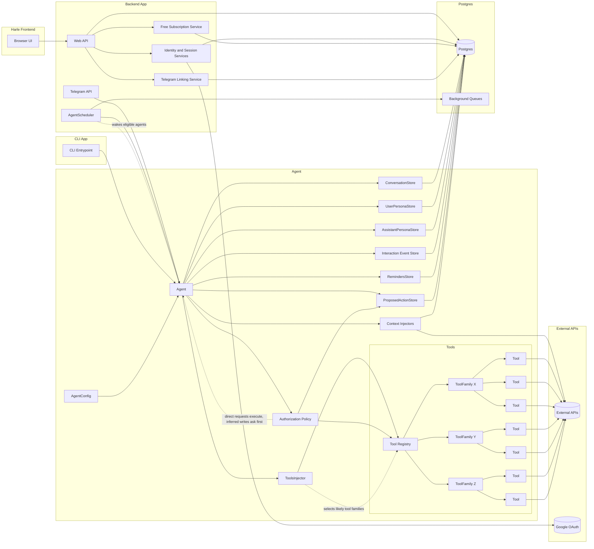

# Software Requirements Specification

## Introduction

Harle is a Telegram-first AI assistant product that should be fast, low-cost, safe, private, deeply personal, and useful for multiple subscribed users. This SRS is based on [the vision](01_VISION.md), [the feature scope](02_FEATURES.md), the current controlled-beta implementation, and the product decisions confirmed so far.

This repository owns the assistant engine, Telegram runtime, memory, user data handling, life-management tools, web authentication, commerce integration, and the API consumed by `harle-frontend`. The separate frontend project owns browser presentation and client-side interaction, but it must not duplicate backend business rules.

This document distinguishes the implemented controlled-beta baseline from target requirements that remain pending. Pending requirements remain part of the product unless they are explicitly placed in a later scope.

## Environment

- Users interact with Harle primarily through Telegram from mobile devices.
- Users may share sensitive personal information, personal history, financial data, routines, goals, worries, and emotional context.
- The controlled beta serves multiple subscribed users, each with isolated data, configuration, tools, memories, and permissions.
- Landing pages and browser UI are handled by `harle-frontend`. This backend handles registration, authentication, payment-provider integration, subscription ownership, Telegram linking, and authenticated data access.
- Telegram is the only first-product chat channel. WhatsApp is a future channel because of broader market reach.
- The commercial runtime uses one FastAPI process and PostgreSQL. The CLI remains a local development interface.
- Harle uses an AI model provider for reasoning and response generation, currently Gemini through the official Google API.
- Harle can use Google Search grounding for current information when needed.
- Harle can query real-world context such as current date, time, and weather.
- Commercial users use internal PostgreSQL expenses and events. Juan José Farina alone retains the private legacy Google Sheets expense integration.
- Some connected tools are read-only in effect, while others modify user data or external services.
- Users expect Harle to be human-like in tone and behavior while remaining transparent that it is AI whenever identity is relevant.
- Users may rely on Harle for companionship and life improvement, but Harle must not act as a doctor, psychologist, therapist, or clinical authority.

## Implemented Controlled-Beta Baseline

- Telegram identities map to manually provisioned internal users with a configured plan and subscription status.
- Harle, conversation stores, profiles, tool handlers, and user context are constructed or bound for the resolved user.
- PostgreSQL stores Telegram conversations, tool interactions, profiles, personal history, internal expenses, internal events, and Telegram update claims.
- Tool authorization gives commercial users internal expenses and events. Juan receives internal events and legacy Google Sheets expenses instead of internal expenses.
- Commercial expenses use Argentine pesos, fixed categories, permanent deletion, and transaction UUIDs. Updating or deleting one installment affects its complete installment group.
- Internal events are private timed or all-day `user_event` or `system_event` records. They may be one-time, repeat weekly on `week_days`, or repeat monthly on `month_days`; disabling is reversible and deletion is permanent.
- Every event has a notification window and optional `last_notified_at`. A process-local scheduler wakes the owning active user's agent every five minutes for due one-time or derived recurring occurrences and records successful delivery.
- Supported Telegram images, voice notes, and audio files are sent directly to Gemini. The ten newest user-owned Telegram references remain available through a read-only tool for twelve hours on a best-effort process-local basis.
- Telegram updates are persisted and deduplicated before assistant execution. Consecutive messages may join a turn until tool execution or delivery begins.
- The tenth valid message within two seconds triggers a per-identity cooldown. Cooldowns escalate from 60 seconds to 5 minutes and then 1 hour, and strikes decay after normal use.
- Manually provisioned exact subscription-period boundaries define conversation and event-notification allowances. Completed conversations and successful ordinary event deliveries use separate configured plan limits with process-local in-flight reservations.
- The unversioned `/api` surface provides Google registration, revocable browser sessions, renewable free-account periods, safe session state, and short-lived Telegram deep links.
- Telegram link commands are deduplicated and consumed before ordinary admission without invoking Gemini. Linked identities then use the existing agent path.
- Runtime authorization for inferred writes, action audits, durable work queues, paid subscriptions, email/password authentication, broader web management, privacy workflows, and multi-user Google integrations remain pending.

## User Requirements

- **UR-01 Telegram access**: A subscribed user shall be able to talk to Harle through Telegram.
- **UR-02 Multi-user isolation**: Each user shall experience Harle as a private personal assistant with isolated conversations, profile data, tools, credentials, and preferences.
- **UR-03 Natural conversation**: Harle shall respond in the user's language with a concise, natural, warm, and useful style.
- **UR-04 Personal memory**: Harle shall remember prior conversations, user-provided personal history, durable facts, preferences, routines, goals, and learned patterns.
- **UR-05 User profile**: Harle shall maintain a profile of the user that improves personalization over time.
- **UR-06 Agent profile**: Harle shall maintain its own configurable assistant profile, changeable under user direction, without claiming to be human.
- **UR-07 Memory control**: The user shall be able to inspect, correct, delete, and refine memory, user profile data, and agent profile data.
- **UR-08 Read on request**: Harle may read or query connected data when the user asks a question and the action does not modify the environment.
- **UR-09 User-authorized modification**: Harle shall modify data immediately only when the current user message directly requests it. The target product shall require explicit confirmation before executing an inferred or assistant-proposed modification.
- **UR-10 Personal finance**: Harle shall help users query, add, correct, and understand personal finance data through natural conversation.
- **UR-11 Productivity support**: Harle shall provide private internal events, simple weekly or monthly recurrence, and process-local Telegram notifications, and may later add durable delivery or external calendar integration.
- **UR-12 Companionship**: Harle shall help users feel better, reflect, stay organized, and improve their lives while respecting healthy relationship boundaries.
- **UR-13 Proactive support**: The target product shall provide one user-controlled interaction event per account so Harle can occasionally initiate a conversation after ordinary event work, with bounded probability and inactivity behavior.
- **UR-14 Privacy and safety**: Harle shall protect user data, minimize unnecessary exposure, and make safety a core product behavior.
- **UR-15 Transparency**: Harle shall not hide that it is AI or simulate human identity in manipulative ways.
- **UR-16 Reliability**: Harle shall report failures clearly when it cannot answer or complete a requested action.
- **UR-17 Efficiency**: Harle shall pursue fast and inexpensive responses suitable for frequent daily use.
- **UR-18 Event notification allowance**: Each plan shall provide a separate, visible allowance for successful event notifications during the user's synchronized subscription period without consuming conversation quota.
- **UR-19 Google registration**: A user shall be able to create or access an account through Google.
- **UR-20 Web session**: A user shall be able to inspect and end a secure, revocable browser session.
- **UR-21 Free access**: A newly registered user shall receive an active free plan whose monthly allowance period renews automatically.
- **UR-22 Telegram linking**: An authenticated user shall be able to prove ownership of a Telegram identity and link it to the same internal account.
- **UR-23 Account status**: An authenticated user shall be able to inspect safe account, free-plan period, and Telegram-link state.

## System Specification

### Identity, Access, and Subscription

- **FR-01**: The Telegram webhook shall validate Telegram's webhook secret before processing any update.
- **FR-02**: The system shall extract Telegram chat ID, Telegram user ID, display name, text, captions, and supported image or audio references from incoming Telegram updates.
- **FR-03**: The system shall reject empty, unsupported, malformed, unauthorized, or unsubscribed messages without invoking the assistant engine.
- **FR-04**: The system shall resolve each Telegram sender through a multi-user external-identity registry.
- **FR-05**: The system shall map each allowed Telegram user to one internal user account.
- **FR-06**: The controlled beta shall support explicit user provisioning. The target broad release shall provision users through the web identity and commerce services in this backend and synchronize provider-confirmed subscription state into the account runtime.
- **FR-07**: The system shall deny assistant access when a user's subscription is inactive, expired, missing, or revoked.
- **FR-08**: User integrations shall be scoped to the internal account. Juan's private legacy Google Sheets credentials and spreadsheet identifiers may remain process configuration, but access shall depend only on his configured stable internal UUID.

### Conversation Runtime

- **FR-09**: The Telegram runtime shall send a typing action before generating a response when possible.
- **FR-10**: The assistant engine shall load conversation context, user profile, agent profile, personal history, current date and time, relevant environmental context, and relevant tool families before answering.
- **FR-11**: Context loading should run concurrently where safe, so slow data sources do not unnecessarily delay the response.
- **FR-12**: The assistant shall answer directly or call an available authorized tool. The target runtime may instead ask for authorization when a modification was not directly requested.
- **FR-13**: The assistant shall execute at most a configured number of reasoning and tool loops for one user message.
- **FR-14**: The assistant shall return a user-facing failure message when model output is invalid, unavailable, or cannot be parsed.
- **FR-15**: The Telegram runtime shall split long responses into Telegram-compatible message chunks.
- **FR-16**: The system shall persist the final user prompt and assistant response after each handled conversation. A media prompt shall retain a compact attachment marker, caption, and filename when available, but not the raw media bytes.

### Telegram Intake, Ordering, Bans, and Quotas

- **FR-68**: The webhook shall persist and claim each Telegram `update_id` before quota checks, Gemini calls, or tool execution.
- **FR-69**: A duplicate update shall create no second Gemini call, conversation, response, or tool modification, including after a process restart.
- **FR-70**: Consecutive messages from one Telegram identity shall join the active turn while reasoning remains safe to cancel and restart. Messages arriving after tool execution or response delivery begins shall become the next turn.
- **FR-71**: Conflicting work for one Telegram identity shall be serialized without blocking other identities. Process-local coordination is permitted while deployment remains one process.
- **FR-72**: Every newly persisted valid update shall count independently toward a rolling safety window, even when messages later join one turn.
- **FR-73**: The tenth valid update within two seconds shall trigger a ban for only that Telegram identity. Cooldowns shall escalate from at least 60 seconds to 5 minutes and then 1 hour, strikes shall decay after normal use, and Harle shall send at most one notice per cooldown.
- **FR-74**: Duplicate, malformed, temporarily banned, unauthorized, inactive, and operationally rejected updates shall not invoke Gemini or consume subscription-period conversation quota.
- **FR-75**: Usage shall count only successful rows where `kind = 'conversation'` and `status = 'completed'`, using the user's synchronized subscription-period start as the inclusive boundary and period end as the exclusive boundary.
- **FR-76**: Quota admission shall include process-local in-flight reservations, release reservations on every outcome, and exclude tool calls, retries, failed conversations, and individual messages aggregated into one conversation.
- **FR-77**: An over-quota response shall expose the remaining allowance and exact synchronized subscription-period end without invoking Gemini.
- **FR-78**: Plan limits shall come from account or plan configuration. The initial free, basic, and max limits are 60, 480, and 1,920 monthly conversations.
- **FR-79**: Conversation and tool-interaction persistence shall use stable update-derived identifiers where required to prevent duplicate records.

### Memory and Profiles

- **FR-17**: The system shall persist all prior conversations in durable storage for product users.
- **FR-18**: The system shall make prior conversations available to Harle through a bounded-context strategy. Retrieval and summarization may be added later.
- **FR-19**: The system shall store user profile data separately from raw conversation history.
- **FR-20**: The system shall store agent profile data separately from user profile data.
- **FR-21**: The system shall preserve user-provided personal history as first-class memory.
- **FR-22**: The target product shall provide commands or flows for users to view, correct, delete, and refine stored memory.
- **FR-23**: The target product shall change user memory, user profile data, or agent profile data only after direct user request or explicit user authorization.
- **FR-24**: Memory retrieval shall respect per-user isolation and must never include another user's data.

### Authorization and Tool Safety

- **FR-25**: Every tool shall declare whether it is read-only or environment-modifying.
- **FR-26**: Read-only tools may run after a user request without an additional authorization step.
- **FR-27**: Environment-modifying tools may execute immediately when the current user message directly requested the modification and the required arguments are clear.
- **FR-28**: The controlled beta shall instruct Harle not to call a modifying tool unless the current message directly requests the change. A separate runtime gate remains pending.
- **FR-29**: The target runtime shall persist an inferred, suggested, or proactive modification as a proposed action instead of executing it.
- **FR-30**: A proposed action shall identify the change, service, affected data, owner, expiration, and authorization state.
- **FR-31**: The target runtime shall execute a proposed action only after the same user confirms it, and shall support cancellation, expiration, duplicate confirmation, and a clear final result.
- **FR-32**: Failed tool actions shall return a clear explanation and should not silently retry in ways that risk duplicate writes.
- **FR-33**: Tool results shall be included in the assistant's reasoning context for the current response.

### Personal Finance

- **FR-34**: Harle shall query a user's finance data for a specific day.
- **FR-35**: Harle shall summarize a user's finance data for a specific month.
- **FR-36**: Commercial finance records shall use PostgreSQL, Argentine pesos, positive stored amounts, and explicit expense or refund semantics.
- **FR-37**: Harle shall add purchases in 2 to 12 installments, allocate currency fractions deterministically, use the selected date for the first installment, and use the first day of each following month thereafter.
- **FR-38**: Commercial finance corrections shall use transaction UUIDs. Updating or permanently deleting an installment transaction shall affect its entire installment group while preserving the installment count on update.
- **FR-39**: Harle shall support the current expense categories for rent, essential services, non-essential services, home, transport, outings, shopping, and other expenses.
- **FR-40**: A transaction without an explicit date created from 00:00 through 04:59 in the user's local timezone shall use the previous calendar day, and Harle shall tell the user when this rule applies.
- **FR-41**: Finance tools shall validate amounts, dates, months, categories, refund flags, and installment counts before proposing or executing changes.
- **FR-42**: Every internal finance operation shall filter by the requesting user's UUID. Legacy Google Sheets tools shall not modify cells outside the configured expense ranges.
- **FR-43**: Commercial users shall receive internal expense tools. Only Juan's configured stable internal UUID shall receive, construct, or execute legacy Google Sheets expense tools.

### Productivity

- **FR-44**: The controlled beta shall provide private one-time, weekly, or monthly internal events with process-local notifications to every entitled user.
- **FR-45**: Harle shall list owned events overlapping a bounded local date range, excluding disabled events unless the user requests them.
- **FR-46**: Harle shall create, update, disable, re-enable, or permanently delete only events owned by the requesting user and only when the current message directly requests the modification.
- **FR-47**: Events shall support timed and all-day schedules, preserve the originating IANA timezone, store UTC boundaries, and require the end to follow the start.
- **FR-48**: Controlled-beta events shall create no attendees, external synchronization, quiet-period behavior, or durable background work. Later reminder or calendar integrations shall be user-scoped, revocable, and governed by the target authorization policy.
- **FR-80**: Internal events shall have type `user_event` or `system_event`. User events represent the user's real-life agenda; system events represent internal reminders or tasks for the agent.
- **FR-81**: Every event shall have `notification_window_start` and optional `last_notified_at`. Both event types shall default to a zero-minute lead, so the notification window opens at event start, while positive values shall configure a custom pre-start lead.
- **FR-82**: A process-local `AgentsScheduler` shall run every five minutes and select unnotified active one-time events whose notification window is open and whose one-hour post-end grace period has not passed, plus active recurring definitions that may produce such a local occurrence.
- **FR-83**: The scheduler shall wake the owning user's request-scoped agent for every selected event. The agent shall treat user events as agenda context and system events as user-owned scheduled task context.
- **FR-84**: A successful notification shall update `last_notified_at`. Failed delivery shall leave it unchanged for retry, disabling an event shall suppress all occurrences, and re-enabling shall resume them.
- **FR-85**: Harle shall accept supported images, voice notes, and ordinary Telegram audio messages as multimodal conversation input and provide their bytes directly to the configured Gemini model. Voice notes are the primary audio target, and audio sent as a generic document may remain unsupported.
- **FR-86**: A future authorized agent tool may invoke a controlled migration or synchronization service to import Google Sheets expenses and Google Calendar events into the internal expense and event systems.
- **FR-87**: WhatsApp may be added as a later communication channel after the Telegram product and channel-independent runtime boundaries are stable.
- **FR-88**: A recurring internal event shall remain one event record and shall create no stored occurrence rows. Its `recurrence_rule` shall contain either a non-empty `week_days` list of unique weekdays or a non-empty `month_days` list of unique month days from 1 through 31. `week_days` implies weekly recurrence and `month_days` implies monthly recurrence.
- **FR-89**: Recurrence shall be infinite. A month day that does not exist in a particular month shall produce no occurrence in that month.
- **FR-90**: A recurring event shall preserve the ordinary timed, all-day, multi-day, timezone, type, title, description, and notification-lead behavior. Its stored start and end define the local schedule used for every matching recurrence. An omitted recurrence rule on update shall preserve it, while an explicit null rule shall convert the event to one-time.
- **FR-91**: Event reads shall treat a recurring event as one owned event definition. A bounded date-range read shall include it when its recurrence rule produces at least one matching local occurrence in that range.
- **FR-92**: The event lifecycle shall use active and disabled event states plus permanent deletion. Disabling an event shall stop its occurrences and notifications until it is re-enabled. The lifecycle shall not expose cancellation or notification-only enablement as separate states.
- **FR-93**: A successful recurring notification shall update the event's `last_notified_at`. The scheduler shall send only from a computed occurrence's notification-window start until one hour after its end while `last_notified_at` precedes that window. Failed delivery shall not update the field, and an occurrence whose one-hour grace period has passed shall be skipped.
- **FR-94**: The scheduler shall derive recurring occurrences from the recurrence rule in the event's configured local timezone on each bounded check. It shall maintain no next-occurrence cursor and no per-occurrence notification state.
- **FR-95**: Media attached to the current Telegram message shall be downloaded and included automatically throughout its Gemini reason-and-act loop. A media attachment from an earlier message shall be loaded only when the agent calls an authorized read-only recent-media tool.
- **FR-96**: The process-local recent-media store shall retain at most the ten newest Telegram media references per internal user for at least twelve hours on a best-effort basis. Process restart may discard these references, and raw media bytes shall not remain in the store.
- **FR-97**: The system instruction may expose compact metadata and internal attachment identifiers for available recent media, but shall not expose Telegram file identifiers or raw media. A media tool result shall allow the next Gemini reasoning call to receive the selected media as a native content part.
- **FR-98**: Unsupported media types or formats shall receive a concise `Formato no soportado` Telegram response without invoking the assistant engine or consuming conversation quota. The update shall still follow deduplication policy so a retry does not repeat the rejection response.
- **FR-99**: Telegram file identifiers shall be treated as sensitive references, excluded from logs and model context, and resolved through Telegram again when recent media is requested. Downloaded bytes shall be discarded after the active model call.
- **FR-100**: The combined raw size of all media attached to one aggregated turn shall not exceed 12 MiB. A single attachment whose declared size exceeds that limit should be rejected before download.

### Event Notification Quotas

- **FR-101**: Every plan shall configure a positive event-notification limit per synchronized subscription period, separate from its conversation limit. The initial free, basic, and max limits shall be 15, 60, and 240 notifications.
- **FR-102**: Event-notification quota periods shall use each user's exact synchronized `subscription_period_starts_at` inclusive boundary and `subscription_period_ends_at` exclusive boundary. Both `user_event` and `system_event` notifications shall use the same allowance.
- **FR-103**: Quota usage shall count each successfully delivered Telegram event notification once. Failed generation, failed delivery, safe retries, blocked occurrences, and quota-exhausted notices shall not count.
- **FR-104**: The scheduler shall reserve event-notification allowance before invoking Gemini. Admission shall include successful deliveries and in-flight reservations so concurrent work cannot exceed the configured plan limit.
- **FR-105**: A quota-blocked occurrence shall not invoke Gemini and shall not update the event's `last_notified_at`. It may be reconsidered while its start remains in the future and shall otherwise expire under the ordinary event-notification policy.
- **FR-106**: On the first blocked occurrence for one user in a subscription period, Harle shall send at most one static quota-exhausted Telegram notice without invoking Gemini or consuming either quota. The notice shall identify the plan limit and synchronized period end.
- **FR-107**: Relevant event-management responses shall make the notification limit, remaining successful deliveries, and synchronized subscription-period end available to the user.
- **FR-108**: Successful notification deliveries shall be recorded in a user-owned ledger with the event reference, computed occurrence start, notification window, and delivery time. Event deletion shall not restore consumed allowance, and account deletion shall handle these records under the product's deletion policy.

### Subscription Periods and Scheduled Interaction

- **FR-109**: The backend commerce service shall synchronize each user's provider-confirmed `subscription_period_starts_at` and `subscription_period_ends_at` as timezone-aware UTC instants. The start shall precede the end.
- **FR-110**: Conversation and event-notification allowance calculations shall use the synchronized current period without deriving boundaries from account creation, an original subscription date, or UTC calendar months. `subscription_valid_until` shall remain a separate access-expiration field.
- **FR-111**: Every successfully delivered `user_event`, `system_event`, or `interaction_event` message shall be persisted in conversation history as a standalone assistant message. Persistence shall not fabricate a user prompt, imply that a user response exists, or make the row count toward conversation quota. Read-only tool interactions used by the scheduled run shall use the existing tool-interaction history contract.
- **FR-112**: Every user shall own exactly one internal `interaction_event`. It shall have no fixed start, end, notification window, recurrence rule, or materialized occurrence because its eligibility is calculated from contact activity on every scheduler pass.
- **FR-113**: An interaction event shall support only active and disabled states. The user may disable and re-enable it, but neither user tools nor ordinary event deletion shall delete it.
- **FR-114**: On each scheduler pass, Harle shall process due `user_event` and `system_event` occurrences first. A due ordinary occurrence shall suppress only the same user's interaction-event evaluation for that pass, whether or not generation or delivery succeeds; it shall not suppress other users.
- **FR-115**: For an eligible interaction event, let `t` be the elapsed duration since the user's latest contact, `Δ` the scheduler interval, and `λ` the user's assistant-profile interaction scale. The next-pass trigger probability shall be `1 - exp(-(((t + Δ) / λ)^2 - (t / λ)^2))`. High, medium, and low frequencies shall use 12-hour, 24-hour, and 48-hour scales respectively, with high as the default. Users shall be able to inspect and change this preference through assistant tools. The shape-2 policy shall remain invariant when the scheduler interval changes.
- **FR-116**: Latest contact shall be the later of the latest actual user message and any successfully delivered assistant message, including a normal conversation response, ordinary event notification, or interaction-event message. Every successful assistant delivery shall reset the probability clock.
- **FR-117**: Harle shall not trigger an interaction event when the latest actual user message is more than seven days old. The event shall remain active and automatically become eligible again after a new user message.
- **FR-118**: An interaction-event run shall load user and assistant profiles, conversation history, current time, current weather, Google Search grounding, and all authorized tools whose declared effect is read-only. Modifying tools shall be absent from the runtime tool store rather than prohibited only by prompting.
- **FR-119**: Interaction events shall have no quiet period, shall not wait for or require a user response, and shall consume neither conversation nor event-notification allowance. A delivered interaction message shall simply reset the probability clock before it begins growing again.
- **FR-120**: The interaction-event delivery and its standalone conversation-history entry shall be recorded only after successful Telegram delivery. Failed generation or delivery shall not reset contact time.

### Companionship and Safety

- **FR-49**: Harle shall preserve a warm, useful, concise, and non-performative conversation style.
- **FR-50**: Harle shall be transparent that it is AI when identity or nature is relevant.
- **FR-51**: Harle shall not claim to be a human, doctor, psychologist, therapist, lawyer, financial advisor, or other professional authority.
- **FR-52**: Harle shall encourage appropriate human or professional help when user needs exceed the assistant's role.
- **FR-53**: Harle shall avoid manipulative behavior, dependency-building patterns, and advice that reduces user agency.
- **FR-54**: Harle shall initiate proactive check-ins only through an active user-owned interaction event and according to FR-112 through FR-120.

### Runtime Architecture

- **FR-55**: The controlled-beta runtime shall support request-triggered Telegram runs and process-local scheduled ordinary and interaction-event runs under FR-112 through FR-120.
- **FR-56**: The scheduler shall select interaction events per user only after ordinary event work, using the event's active state, the seven-day user-inactivity cutoff, latest contact, and bounded probability rule. Interaction events require no quiet-period evaluation.
- **FR-57**: A scheduled run shall load the owning user's conversations, profiles, and relevant external context without consuming conversation quota. Its runtime tool store shall contain all authorized read-only tools and no modifying tools. Ordinary event notifications shall reserve event-notification allowance before Gemini; interaction events shall not reserve either allowance.
- **FR-58**: The target broad-release runtime shall use durable background queues for accepted inbound work and outbound delivery. Future scheduler work, proposed actions, and integration polling shall also use durable queues when work must survive interruptions.
- **FR-59**: The runtime shall construct user-scoped stores and tool configuration from the resolved internal user account. Only Juan's UUID-gated legacy Google Sheets compatibility path may use integration settings from process configuration.
- **FR-60**: Stores that require external connections shall use process-wide connection pools where appropriate while preserving per-user data boundaries in store adapters.
- **FR-61**: Context providers shall expose current time and weather from user-scoped timezone and location inputs. Cached or polled reminders, calendar state, and other authorized context may be added later.
- **FR-62**: Context injectors may be process singletons only when shared state is safe; user-specific values, credentials, and permissions shall remain isolated by account.
- **FR-63**: The tool system shall maintain a registry of tool families, tool names, descriptions, argument schemas, read-only or modifying classification, and execution policy.
- **FR-64**: The tools injector shall select the tool families most likely to help with the current prompt and runtime context instead of always injecting every full tool prompt.
- **FR-65**: The assistant may receive a compact list of all available tool names for discoverability, but detailed tool descriptions and argument contracts should be limited to the most relevant tools.
- **FR-66**: Modifying tools shall distinguish direct requests from inferred or proactive actions. The controlled beta enforces this through the assistant instruction; the target runtime shall enforce it through proposed actions.
- **FR-67**: Future reminder storage shall support user ownership, content, schedule, delivery status, cancellation, and links to any originating conversation or proposed action. It shall not introduce a second event-recurrence model.

### Web API Contract

The endpoint catalog in this section is the backend source of truth for `harle-frontend`. The first web release supports Google registration, renewable free accounts, sessions, and Telegram linking. Email/password authentication, paid subscriptions, account management, expense and event management, export, and deletion remain later work.

#### Conventions and authorization

- **FR-121**: Browser-facing endpoints shall use the unversioned `/api` prefix. The backend and its only browser client shall evolve together. The existing `/telegram/webhook` and `/healthcheck` routes remain outside that prefix.
- **FR-122**: JSON payloads shall use `snake_case`, UUIDs shall remain opaque strings, calendar dates shall use ISO `YYYY-MM-DD`, instants shall use timezone-aware RFC 3339 values, and money shall use decimal strings plus an explicit currency.
- **FR-123**: Errors shall use one envelope containing a stable code, safe user-facing message, optional field errors, and request identifier. Validation, authentication, authorization, conflict, quota, and provider failures shall remain distinguishable.
- **FR-124**: Authenticated endpoints shall resolve the internal user exclusively from the server-side session. A client-supplied user UUID shall never grant ownership.
- **FR-125**: Browser sessions shall use revocable opaque identifiers in `Secure`, `HttpOnly` cookies with an appropriate `SameSite` policy. State-changing cookie-authenticated requests shall require CSRF protection.
- **FR-126**: Credentialed cross-origin access shall use an explicit frontend-origin allowlist. Wildcard origins shall not be combined with credentials.
- **FR-127**: Telegram-link and other retry-sensitive writes shall return a safe prior result or invalidate earlier pending state when retried.
- **FR-128**: API response models shall be service or domain contracts and shall not expose PostgreSQL rows, provider payloads, password hashes, Telegram identifiers, or secrets directly.

#### Google identity and free accounts

- **FR-129**: `GET /api/auth/google/start` and `GET /api/auth/google/callback` shall implement Google OpenID Connect authorization-code flow with validated `state`, `nonce`, PKCE, fixed redirects, and stable provider subject identifiers.
- **FR-130**: The Google authorization start shall bind the browser-provided locale and valid IANA timezone to the protected OAuth state used during first-account provisioning.
- **FR-131**: A first successful Google callback shall atomically create an active free user, Google external identity, user profile, assistant profile, and exact monthly allowance period.
- **FR-132**: A returning Google subject shall resolve the same internal user and shall not create duplicate account or profile records.
- **FR-133**: Google sign-in shall not merge accounts by email. The stable verified provider subject shall be the login identity.
- **FR-134**: Active free accounts shall renew their exact monthly allowance period automatically while preserving the period boundary sequence.
- **FR-135**: Free-period renewal shall occur before Telegram conversation admission and scheduled-user resolution so period expiration alone does not interrupt active free service.
- **FR-136**: Google sign-in shall link to an existing account only under an explicit safe linking policy; a matching unverified email alone shall not silently merge accounts.
- **FR-137**: `GET /api/session` shall return the authenticated user's safe account, free-plan period, Telegram-link state, and CSRF metadata without returning authentication secrets or provider identifiers.
- **FR-138**: `POST /api/auth/logout` shall revoke the current session and clear its cookie.

#### Telegram linking

- **FR-139**: `GET /api/account/telegram-link` shall return only disconnected, pending, or connected state plus safe expiry metadata.
- **FR-140**: `POST /api/account/telegram-link` shall invalidate earlier pending tokens and issue a short-lived, single-use token bound to the authenticated account.
- **FR-141**: The returned Telegram deep link shall carry the raw token only in its bot start parameter. PostgreSQL shall store only its hash.
- **FR-142**: The Telegram webhook shall identify a link command before agent admission, claim its update for deduplication, consume the token atomically, and attach the Telegram identity without invoking Gemini.
- **FR-143**: A user shall own at most one Telegram identity, and a Telegram identity shall belong to at most one user. Linking shall not silently move an existing identity.
- **FR-144**: Link tokens and provider identifiers shall not appear in application logs or frontend-visible account payloads.

#### Deferred web capabilities

- **FR-145**: Email/password authentication, password recovery, public paid-plan discovery, Mercado Pago subscriptions, account/profile mutation, expense management, event management, export, deletion, and Telegram unlinking remain later capabilities requiring separate product approval.

### Nonfunctional Requirements

- **NFR-01 Privacy**: User data shall be private by default and isolated by account.
- **NFR-02 Security**: Secrets shall be loaded from secure configuration and never committed to source control.
- **NFR-03 Least privilege**: External tool credentials shall request the minimum practical permissions.
- **NFR-04 Auditability**: Before broad launch, environment-modifying actions shall be auditable with user, timestamp, proposed action when applicable, authorization, and final result.
- **NFR-05 Sensitive logging**: Logs shall avoid storing full personal conversations, private profile content, credentials, or unnecessary tool payloads.
- **NFR-06 Transport security**: Production traffic shall use HTTPS and secure webhook configuration.
- **NFR-07 Data durability**: Product conversation data shall use durable storage. Before broad launch, the system shall add verified backups and migration-safe schema evolution.
- **NFR-08 Data deletion**: Before broad launch, the system shall support user data deletion consistent with the product's privacy policy.
- **NFR-09 Latency**: The system shall minimize user-perceived latency through concurrency, caching, concise prompts, and efficient model selection.
- **NFR-10 Cost**: The system shall minimize token usage and external API cost without degrading useful answer quality.
- **NFR-11 Reliability**: The system shall handle provider failures, malformed model output, Telegram failures, and tool failures gracefully.
- **NFR-12 Maintainability**: Assistant, API, storage, and tools shall remain modular enough to add new integrations without creating a brittle tool collection.
- **NFR-13 Observability**: Before broad launch, production operations shall expose enough safe logs, metrics, and health checks to detect failures and cost regressions.
- **NFR-14 Compliance discovery**: Legal, privacy, and security obligations for storing sensitive user data shall be investigated before broad paid release.
- **NFR-15 Background reliability**: Process-local event notifications shall retry failed delivery while the notification window and one-hour post-end grace period remain open. Future queued work and durable outbound notifications shall be observable, retryable where safe, and auditable enough to diagnose missed or duplicate actions.
- **NFR-16 API compatibility**: Browser-contract changes shall be coordinated directly with the owned `harle-frontend` client.
- **NFR-17 Web security**: Authentication, OAuth, session, CSRF, CORS, and account-linking controls shall follow current OWASP guidance and be independently tested before broad launch.
- **NFR-18 OAuth reliability**: Google callback processing shall validate state, nonce, PKCE, issuer, audience, and verified identity claims without trusting browser-supplied account data.

## Program

Harle is conceptually divided into these program areas:

- **Telegram interface**: Receives Telegram webhook updates, validates access, extracts messages, sends typing indicators, sends responses, and enforces Telegram message limits.
- **Web API interface**: Exposes the unversioned authenticated JSON contract used by `harle-frontend`, performs payload validation, and delegates every business operation to services.
- **CLI interface**: Provides a local entry point for direct prompts while reusing the same assistant engine, stores, tools, and model configuration.
- **Identity and session services**: Integrate Google OAuth, create and revoke browser sessions, provision free accounts, and enforce web abuse controls.
- **Free subscription service**: Activates and renews exact free-plan allowance periods independently from agent reasoning.
- **Telegram-linking service**: Issues one-time account-bound link tokens and completes identity attachment only after proof arrives through the Telegram bot.
- **Assistant engine**: Builds user-scoped context, calls the model, parses structured output, executes available tools, caps tool loops, and returns final text.
- **Message coordinator**: Deduplicates Telegram updates, aggregates safe consecutive messages, and serializes conflicting work per identity.
- **Memory and profile stores**: Persist conversations, retrieve bounded context, and store durable user and assistant profile data.
- **Expense and event stores**: Persist user-owned internal expenses, typed events, notification windows, recurrence definitions, and successful-notification timestamps.
- **Context providers**: Provide current date, time, and weather from user-specific timezone and location inputs.
- **Tool system**: Defines tool families, effects, argument contracts, authorization, prompt relevance, request-scoped handlers, and structured results.
- **Preflight services**: Resolve identity, subscription, and exact synchronized subscription-period boundaries, apply temporary bans, and reserve conversation quota before assistant execution.
- **Event scheduler**: Processes ordinary due events every five minutes, then independently evaluates interaction events for users without ordinary due work, wakes the owning active user's agent, sends Telegram messages, and records successful delivery.
- **Event-notification quota service**: Resolves plan allowance for the user's synchronized subscription period, reserves capacity before ordinary event generation, records successful occurrence deliveries, and suppresses repeated quota notices.
- **Future runtime services**: Proposed-action, audit, durable delivery, privacy, and Google import services remain pending.
- **External integrations**: Connects to AI providers, Telegram, PostgreSQL, Google OAuth, Google Sheets, future productivity services, and weather data.

The implemented controlled-beta message flow is:

1. Telegram sends an update to the webhook.
2. The API validates the webhook secret and parses supported text, image, voice-note, or audio content.
3. The message coordinator persists or deduplicates the update and applies the per-identity safety limit.
4. Consecutive safe messages join the active turn; later conflicting work is queued.
5. Preflight resolves the internal user, validates subscription and plan, and reserves quota.
6. The runtime loads user-scoped profiles, conversation context, current context, and likely authorized tool families.
7. Harle calls Gemini and responds directly or executes an available tool.
8. Tool execution seals the turn against aggregation before the handler runs.
9. Harle sends the final response and persists the completed conversation and update state.
10. The quota reservation is released on every admitted outcome.

The implemented scheduled-event flow is:

1. `AgentsScheduler` runs every five minutes.
2. It selects active one-time events with an open notification window and active recurring definitions that may produce a due occurrence.
3. The runtime resolves the owning active user's Telegram identity, exact subscription period, separate notification allowance, stores, and context providers.
4. It reserves notification capacity before Gemini. A blocked occurrence does not reach Gemini or update `last_notified_at`, and at most one static quota notice is sent for the user and period.
5. Harle receives each event as agenda or scheduled-task context together with profiles, conversation history, current context, Google Search grounding, and every authorized read-only tool. Modifying tools are absent.
6. Harle sends the notification to the user's private Telegram chat, persists it and any read-only tool interactions without a fabricated prompt, records successful quota usage and assistant contact, and updates `last_notified_at`.
7. Failed generation, delivery, or scheduled-message persistence consumes no allowance and remains eligible under the ordinary notification window policy.

This scheduler entrypoint is not a synthetic inbound user request. It bypasses Telegram intake, aggregation, deduplication, request rate limiting, and conversation-quota admission while reusing the core agent and user-scoped runtime.

The implemented interaction-event flow is:

1. After ordinary due-event candidates are selected, the scheduler identifies users with no due `user_event` or `system_event` in the current pass.
2. For each such user, it loads the single interaction event and continues only when the event and subscription are active.
3. It stops when the user's latest actual message is more than seven days old.
4. It computes elapsed time from the later of the latest user message and latest successfully delivered assistant message, then applies the shape-2 Weibull probability using the assistant profile's high, medium, or low scale and the current scheduler interval.
5. A selected run receives profiles, conversation history, current context, Google Search, and authorized read-only tools, with modifying tools absent.
6. Harle sends a natural proactive message without reserving conversation or event-notification allowance and without waiting for a reply.
7. Successful delivery persists one standalone assistant message and resets the probability clock. Failure changes neither message history nor contact time.

The implemented recurring-event flow is:

1. One internal-event row stores an optional weekly or monthly recurrence rule.
2. A bounded event read determines whether the rule matches its requested local date range and returns the event definition once.
3. Every scheduler check derives a relevant local occurrence and notification window without storing that occurrence.
4. An active event is eligible from its computed notification-window start until one hour after the occurrence ends while `last_notified_at` precedes that window.
5. Successful delivery updates `last_notified_at`; failure leaves it unchanged for retry.
6. Disabling the event suppresses recurrence and notification work, re-enabling resumes it, and deletion permanently removes the row.

The implemented Telegram-media flow is:

1. The webhook parses and claims a supported image or audio update before assistant work.
2. Unsupported media receives one deduplicated Telegram rejection without invoking Gemini or consuming conversation quota.
3. Current-message media is downloaded and attached directly to the complete Gemini reason-and-act loop.
4. The runtime records only its compact prompt marker and stores its sensitive Telegram reference in a user-scoped process-local store.
5. The system instruction lists recent attachments by internal identifier and metadata.
6. The agent may call a read-only tool to download and inject one of the ten newest references while it remains within the best-effort twelve-hour window.
7. Downloaded bytes are discarded after active use.

The target free web registration flow is:

1. `harle-frontend` supplies the browser locale and IANA timezone when it starts Google authentication.
2. The backend validates the Google callback and either creates a complete active free account or resolves the existing Google subject.
3. The backend creates a revocable server-side session in a secure cookie.
4. The authenticated user requests a one-time Telegram deep link.
5. The Telegram webhook consumes the token before agent admission and atomically attaches the Telegram identity.
6. The frontend observes the connected state, and later Telegram messages use the existing agent runtime.
7. The backend advances each active free account's exact monthly allowance period before access when renewal is due.

The target authenticated browser flow is:

1. The browser sends its secure session and CSRF proof to an `/api` endpoint.
2. The API resolves the internal account from the session and validates only the payload shape.
3. Account services inspect session and Telegram-link state without importing or invoking agent code.
4. Repositories filter every read and mutation by the resolved owner.
5. The API returns a service or domain contract and the frontend reconciles its state with that confirmed result.

## Machine

The current machine environment is Python 3.10 or newer with FastAPI, Uvicorn, Pydantic, asyncpg, httpx, google-genai, gspread, and Google service account authentication.

Runtime dependencies include:

- **Telegram Bot API** for webhook delivery and message sending.
- **Gemini API** for assistant reasoning and generation.
- **Google Search grounding** through the configured model provider.
- **PostgreSQL** for durable production storage and Telegram update claims.
- **Future durable background queues** for accepted messages, outbound delivery, scheduled runs, proposed actions, and polling work.
- **SQLite and file storage** for local development or compatibility paths.
- **Google Sheets API** for Juan's private legacy personal finance tools.
- **Open-Meteo** for current weather context.
- **Future productivity providers** for reminders or calendar data.
- **Google OAuth** for Google account sign-in.

Production deployment shall provide:

- Secure environment variable management for API keys, Telegram secrets, database URLs, and service credentials.
- Durable PostgreSQL storage with controlled schema changes and backups.
- A webhook endpoint reachable through HTTPS.
- Health checks for platform availability.
- Connection pooling appropriate for expected user count.
- Monitoring for request failures, provider failures, latency, token usage, and tool execution failures.
- Monitoring for duplicate prevention, scheduler and notification failures, notification-quota admission and accounting, and future queue failures.
- Monitoring for Google authentication, session abuse, free-period renewal, Telegram linking, and browser API endpoints.
- Enforcement of the controlled beta's single-process deployment boundary until distributed coordination exists.

Open requirements that need product discovery:

- Exact privacy and legal requirements for storing conversations, profiles, personal history, and finance data.
- Free trials, allowance carry-over, plan changes, taxes, refunds, failed-payment grace, and cancellation timing.
- Session lifetime and safe future account-linking behavior.
- Telegram authorization UX for approving, cancelling, and expiring proposed modifications.
- Final Telegram web-link lifetime, relinking policy, and recovery behavior.
- Durable notification delivery, optional quiet periods for ordinary event notifications, and external calendar integration beyond the process-local event capability.
- The exact long-term Telegram media MIME allowlist beyond the voice-note-first controlled beta.
- Data retention, deletion, export, and backup policies.
- Concrete latency, cost, and reliability targets for paid launch.
- WhatsApp integration requirements for a later product phase.

## Appendix A: Target Architecture Diagram

This diagram represents the intended architecture, not the current implementation state.

```mermaid
flowchart LR
    subgraph WebApp["Harle Frontend"]
        BrowserUI["Browser UI"]
    end

    subgraph CLIApp["CLI App"]
        CLIEntrypoint["CLI Entrypoint"]
    end

    subgraph BackendApp["Backend App"]
        TelegramAPI["Telegram API"]
        WebAPI["Web API"]
        IdentityServices["Identity and Session Services"]
        FreeSubscriptionService["Free Subscription Service"]
        TelegramLinking["Telegram Linking Service"]
        AgentScheduler["AgentScheduler"]
    end

    subgraph AgentRuntime["Agent"]
        AgentConfig["AgentConfig"]
        Agent["Agent"]
        ConversationStore["ConversationStore"]
        UserPersonaStore["UserPersonaStore"]
        AssistantPersonaStore["AssistantPersonaStore"]
        InteractionEventStore["Interaction Event Store"]
        RemindersStore["RemindersStore"]
        ProposedActionStore["ProposedActionStore"]
        ContextInjectors["Context Injectors"]
        ToolsInjector["ToolsInjector"]
        AuthorizationPolicy["Authorization Policy"]

        subgraph ToolRegistry["Tools"]
            ToolRegistryIndex["Tool Registry"]
            ToolFamilyX["ToolFamily X"]
            ToolFamilyY["ToolFamily Y"]
            ToolFamilyZ["ToolFamily Z"]
            ToolX1["Tool"]
            ToolX2["Tool"]
            ToolX3["Tool"]
            ToolY1["Tool"]
            ToolY2["Tool"]
            ToolZ1["Tool"]
            ToolZ2["Tool"]
        end
    end

    subgraph Storage["Postgres"]
        Postgres[("Postgres")]
        BackgroundQueues["Background Queues"]
    end

    subgraph ExternalApis["External APIs"]
        ExternalAPI[("External APIs")]
        GoogleIdentity[("Google OAuth")]
    end

    BrowserUI --> WebAPI
    CLIEntrypoint --> Agent
    TelegramAPI --> Agent
    AgentScheduler --> Agent
    WebAPI --> IdentityServices
    WebAPI --> FreeSubscriptionService
    WebAPI --> TelegramLinking
    WebAPI --> Postgres
    IdentityServices --> Postgres
    FreeSubscriptionService --> Postgres
    TelegramLinking --> Postgres
    IdentityServices --> GoogleIdentity

    AgentConfig --> Agent
    Agent --> ConversationStore
    Agent --> UserPersonaStore
    Agent --> AssistantPersonaStore
    Agent --> InteractionEventStore
    Agent --> RemindersStore
    Agent --> ProposedActionStore
    Agent --> ContextInjectors
    Agent --> ToolsInjector
    Agent --> AuthorizationPolicy

    ConversationStore --> Postgres
    UserPersonaStore --> Postgres
    AssistantPersonaStore --> Postgres
    InteractionEventStore --> Postgres
    RemindersStore --> Postgres
    ProposedActionStore --> Postgres
    AgentScheduler --> BackgroundQueues

    ContextInjectors --> ExternalAPI
    ContextInjectors --> Postgres

    ToolsInjector --> ToolRegistryIndex
    ToolRegistryIndex --> ToolFamilyX
    ToolRegistryIndex --> ToolFamilyY
    ToolRegistryIndex --> ToolFamilyZ
    ToolFamilyX --> ToolX1
    ToolFamilyX --> ToolX2
    ToolFamilyX --> ToolX3
    ToolFamilyY --> ToolY1
    ToolFamilyY --> ToolY2
    ToolFamilyZ --> ToolZ1
    ToolFamilyZ --> ToolZ2

    ToolX1 --> ExternalAPI
    ToolX2 --> ExternalAPI
    ToolX3 --> ExternalAPI
    ToolY1 --> ExternalAPI
    ToolY2 --> ExternalAPI
    ToolZ1 --> ExternalAPI
    ToolZ2 --> ExternalAPI

    AuthorizationPolicy --> ProposedActionStore
    AuthorizationPolicy --> ToolRegistryIndex

    AgentScheduler -. "wakes eligible agents" .-> Agent
    ToolsInjector -. "selects likely tool families" .-> ToolRegistryIndex
    AuthorizationPolicy -. "direct requests execute, inferred writes ask first" .-> Agent
```
