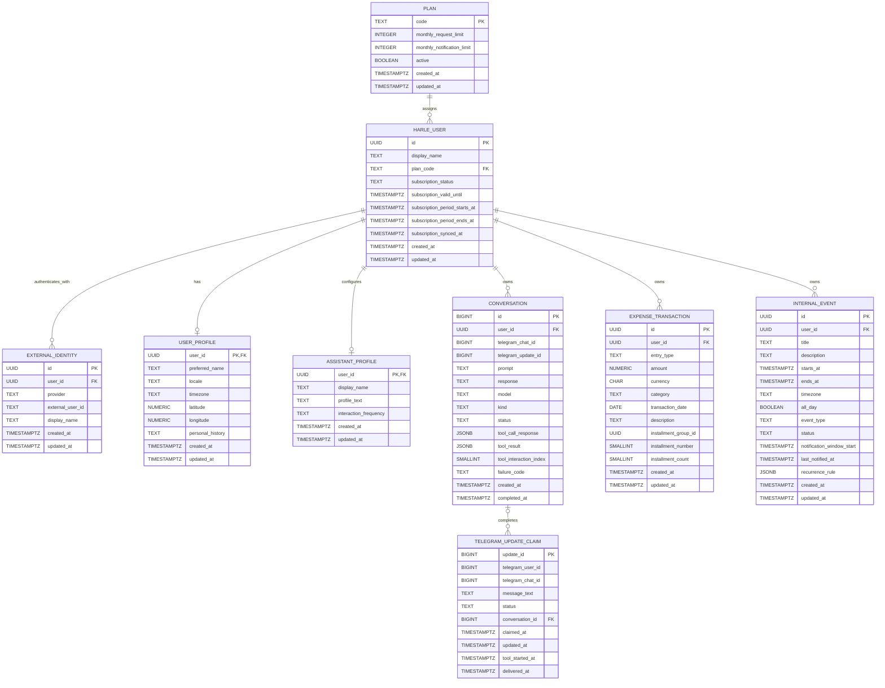
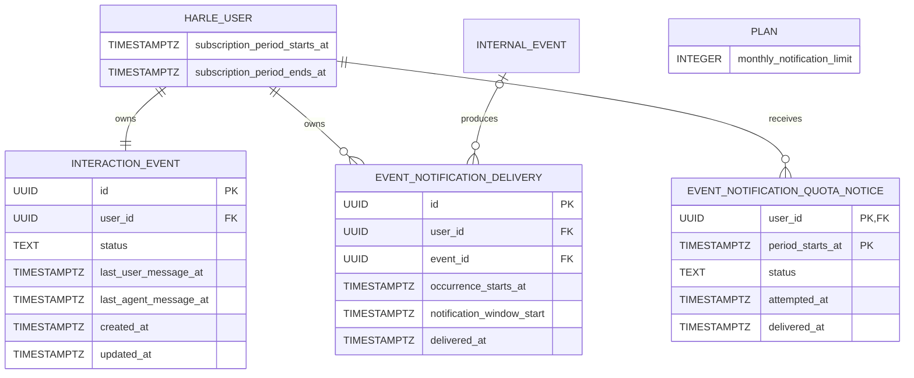
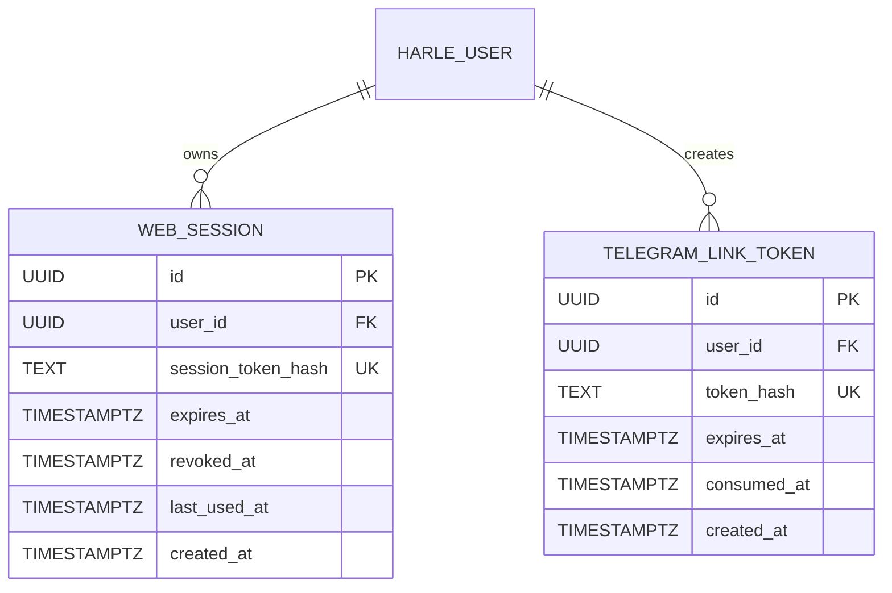

# Entity Relationship Diagram

## Scope

This is a conceptual view of Harle's current PostgreSQL model. The base relationships appear first, followed by the implemented subscription, notification, interaction, and scheduled-message extensions. It aligns with the [SRS](03_SRS.md) and [Project Management Plan](04_PMP.md) while omitting migration-level detail.

## Relationships

| From | To | Cardinality | Notes |
| --- | --- | --- | --- |
| Plan | Harle user | One to many | Every user references one configured plan. |
| Harle user | External identity | One to many | Provider and external user ID are unique together. Telegram is the current provider. |
| Harle user | User profile | One to zero or one | A profile is required before the runtime can serve the user. |
| Harle user | Assistant profile | One to zero or one | The assistant persona is configured independently for each user. |
| Harle user | Conversation | One to many | Conversation and tool-interaction rows are owned by one user. |
| Harle user | Expense transaction | One to many | Commercial expense data is private to its owner. |
| Harle user | Internal event | One to many | Every event query and mutation is owner-scoped. |
| Conversation | Telegram update claim | Zero or one to many | One aggregated conversation may complete multiple Telegram updates. |

## Entity Semantics

### Accounts and Profiles

- Subscription status is `active`, `inactive`, `past_due`, `cancelled`, or `revoked`.
- An external identity cannot belong to two users for the same provider and external identifier.
- Profiles store user-owned personalization separately from conversation history.
- Assistant interaction frequency is `high`, `medium`, or `low`, mapping to 12-hour, 24-hour, or 48-hour Weibull scales. New profiles default to `high`.
- Latitude and longitude are both present or both absent. Timezones use IANA names.
- Juan's Google Sheets privilege is deployment configuration keyed to his stable user UUID; it is not a database role or display-name property.

### Conversations and Telegram Claims

- Conversation rows use kind `conversation`, `tool_call`, or `scheduled_message`.
- A scheduled-message row has no user prompt and stores one successfully delivered assistant message. It is available to later context but excluded from conversation quota.
- Conversation status is `processing`, `completed`, or `failed`; subscription-period quota counts only completed `conversation` rows.
- A non-null Telegram update ID identifies a delivered conversation. Tool interactions also require an update-derived identifier and interaction index for complete idempotency.
- Telegram claim status is `received`, `processing`, `tool_started`, `delivering`, `delivered`, `failed`, `rate_limited`, `interrupted`, or `rejected`.
- Telegram update IDs are globally unique for the bot and persist deduplication state across process restarts.

### Expenses

- Amounts are positive with two decimal places and currency is `ARS`.
- Entry type is `expense` or `refund`; refunds contribute negatively to summaries.
- Categories are fixed to rent, essential services, non-essential services, home, transport, outings, shopping, and other.
- Installment fields are all absent or all present. Counts range from 2 to 12, and installment numbers are unique within one user's group.
- Expense deletion is permanent. Selecting one installment for update or deletion affects its complete group.

### Internal Events

- Event status is `active` or `disabled`.
- Event type is `user_event` for the user's agenda or `system_event` for an internal assistant reminder or task.
- Start and end are stored in UTC while the originating IANA timezone is preserved.
- End must follow start. All-day events use local-midnight boundaries.
- Notification windows may start at the event anchor or earlier. Both event types default to a zero-minute lead, and positive values configure a pre-start lead.
- `recurrence_rule` is absent for a one-time event or contains one non-empty `week_days` or `month_days` list. Recurrence is infinite and creates no occurrence rows.
- A recurring event preserves the ordinary event schedule and fields. A missing month day produces no occurrence in that month.
- Successful notification delivery updates `last_notified_at`; failure leaves it unchanged so delivery remains eligible until one hour after the occurrence ends.
- Disabling is reversible and suppresses occurrences and notifications. Deletion permanently removes the event.

## Indexes and Constraints

- Conversations are indexed by user, chat, creation time, kind, status, and monthly quota range.
- Delivered conversation update IDs and update-plus-tool-interaction identifiers are unique when present.
- Expenses are indexed by user and transaction date, category, and installment group.
- Events are indexed by user, status, and start time, with partial indexes for active one-time notifications and active recurrence definitions.
- Telegram claims use `update_id` as the primary deduplication key and are indexed by status and update time.
- User-owned entities cascade when their owning user is physically deleted, subject to the future retention and deletion policy.

Recent Telegram media remains outside the PostgreSQL ERD while its twelve-hour retention is best-effort. The process-local store contains only user-scoped Telegram references and compact metadata, never raw image or audio bytes.

## Current Subscription, Notification, and Interaction Extensions

These extensions are implemented by the ordered subscription and notification SQL scripts.

- `subscription_period_starts_at` and `subscription_period_ends_at` are exact current UTC boundaries. They are manually provisioned in the controlled beta and will be synchronized from provider-confirmed commerce state. The start is inclusive, the end is exclusive, and `subscription_valid_until` remains a separate access-expiration field.
- Conversation and event-notification usage use the synchronized boundaries. Harle does not derive allowance periods from account creation, an original subscription date, or UTC calendar months.
- `PLAN.monthly_notification_limit` is separate from `monthly_request_limit`; the initial free, basic, and max values are 15, 60, and 240 per synchronized subscription period. Their conversation limits are 60, 480, and 1,920.
- A delivery row represents one successfully delivered `user_event` or `system_event` occurrence. Period usage counts `delivered_at` within the owning user's synchronized boundaries.
- The event identifier, occurrence start, and notification window are unique together so a successful occurrence cannot consume allowance twice.
- Deleting an event sets the ledger's event reference to null instead of deleting its usage. Deleting the owning account removes its delivery and notice records under the account-deletion policy.
- The notice marker permits at most one static, non-Gemini quota-exhausted notice attempt per user and synchronized subscription period. It consumes neither conversation nor event-notification allowance.
- Process-local in-flight reservations remain outside PostgreSQL while deployment is limited to one process. Durable distributed reservations belong with later queue and worker design.
- Every user owns exactly one interaction event. Its status is `active` or `disabled`; the user may change that status but cannot delete the row.
- An interaction event has no start, end, notification window, recurrence, or materialized occurrence. `last_user_message_at` tracks actual inbound activity for the seven-day cutoff, and `last_agent_message_at` advances only after a successful assistant delivery.
- The scheduler evaluates an active interaction event only after the same user has no due ordinary event. Its probability uses the later contact timestamp, resets after successful assistant delivery, and consumes no conversation or event-notification allowance.

## Current Scheduled-Message Extension

The conversation model supports `kind = 'scheduled_message'` in addition to `conversation` and `tool_call`.

- A scheduled-message row stores the assistant text delivered for a `user_event`, `system_event`, or `interaction_event`.
- Its user prompt is absent rather than synthesized, and no pending or expected user response is represented.
- The row is included in later conversation context but excluded from conversation quota.
- Read-only tool interactions from the scheduled run remain separate `tool_call` history rows under the existing interaction contract.
- Scheduled-message persistence occurs only after successful Telegram delivery. Failed generation or delivery creates no history row and does not advance interaction contact state.

## Current Free Web Registration Extension

This implemented model supports Google registration, renewable free accounts, browser sessions, and Telegram linking.

- Google authentication reuses `EXTERNAL_IDENTITY` with provider `google` and a stable provider subject. Telegram continues to use provider `telegram`.
- A user may own at most one identity for each provider, and one provider identity may belong to at most one user.
- A web session stores only a hash of the opaque cookie value and supports independent expiry and revocation.
- A Telegram link token is account-bound, short-lived, single-use, and stored only as a hash. Issuing one invalidates earlier pending tokens for the user.
- Successful bot proof consumes the token and creates the Telegram external identity atomically. It never moves an identity from another user.
- First Google login creates a complete active free user, both required profiles, and exact allowance boundaries. The existing user-insert trigger creates the interaction event.
- Free renewal advances both exact period boundaries by calendar months before conversation or scheduled access while preserving prior boundaries.

## Out Of Scope For This ERD

- Proposed actions and action audits
- Durable Telegram inbox and outbox queues
- Ordinary-event notification preferences and durable scheduler queues or outbox records
- OAuth credentials and multi-user Google integrations
- Email/password credentials and verification or recovery tokens
- Paid-plan catalog metadata, payment subscriptions, and payment webhook claims
- Browser-local UI state and frontend analytics
